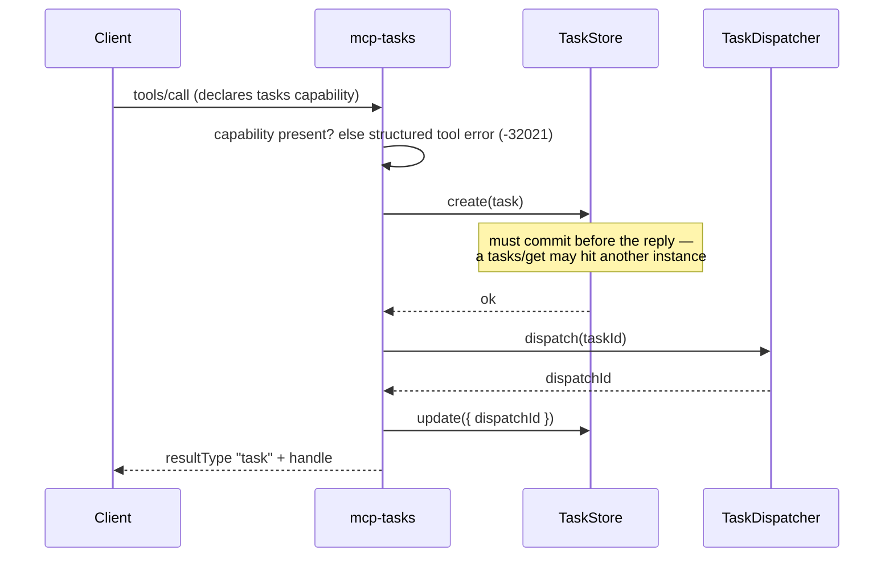
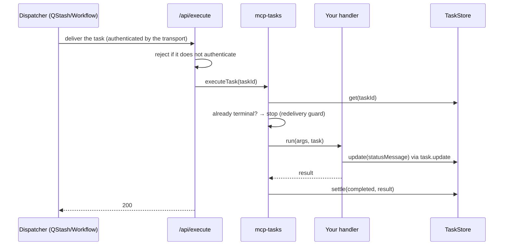
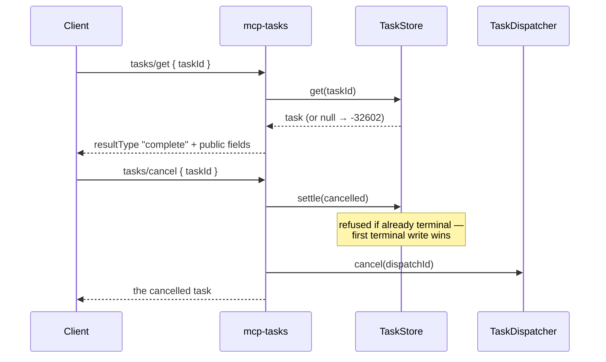

# @upstash/mcp-tasks

A durable [MCP Tasks](https://github.com/modelcontextprotocol/ext-tasks) runtime for the official
TypeScript SDK.

A long-running tool answers with a task handle instead of blocking. The task record lives in
Upstash Redis; the work runs through QStash or Upstash Workflow, so it survives the process that
accepted the call.

> `@modelcontextprotocol/server` v2 ships the 2026-07-28 wire schemas for tasks but no runtime
> behind them — the v1 experimental task APIs were removed with no migration path. This is that
> runtime.
>
> **Wondering what of this belongs in `@modelcontextprotocol/server` itself?** See
> [Could this be part of the TypeScript SDK?](#could-this-be-part-of-the-typescript-sdk) — three
> gaps worth closing upstream, two of which no library can work around.

## Install

```bash
npm install @upstash/mcp-tasks @modelcontextprotocol/server @upstash/redis @upstash/qstash
```

## Usage

```ts
import { McpServer } from "@modelcontextprotocol/server";
import { createTaskLayer, TASKS_PROTOCOL_VERSION } from "@upstash/mcp-tasks";
import { QStashDispatcher, RedisTaskStore } from "@upstash/mcp-tasks/upstash";
import * as z from "zod";

export const tasks = createTaskLayer({
  store: new RedisTaskStore(),
  dispatcher: new QStashDispatcher({ url: `${process.env.APP_URL}/api/execute` }),
});

export function createServer() {
  const server = new McpServer(
    { name: "reports", version: "1.0.0" },
    { supportedProtocolVersions: [TASKS_PROTOCOL_VERSION] },
  );

  tasks.registerTask(
    server,
    "generate_report",
    { description: "Generates a report", inputSchema: z.object({ topic: z.string() }) },
    async ({ topic }) => ({ content: [{ type: "text", text: await writeReport(topic) }] }),
  );

  return server;
}
```

Everything above is required. Progress messages and cancellation are opt-in:

<details>
<summary><b>Reporting progress and honouring cancellation</b></summary>

The handler's second argument is the task. Both calls are optional — a handler that ignores them
still works, it just reports nothing and cannot be stopped early.

```ts
async ({ topic }, task) => {
  for (const source of sources) {
    if (await task.isCancelled()) return {};
    await task.update(`Reading ${source}`);
    await read(source);
  }
  return { content: [{ type: "text", text: await writeReport(topic) }] };
};
```

`task.update(...)` is what the client sees as `statusMessage` on its next poll. Cancellation is
cooperative: `tasks/cancel` flips the record and stops a pending delivery, but running code only
stops where it checks.

</details>

Then two routes — the MCP endpoint, and the one the work is delivered to:

```ts
// app/api/mcp/route.ts
import { WebStandardStreamableHTTPServerTransport } from "@modelcontextprotocol/server";
import { createServer } from "../../lib/tasks";

export async function POST(request: Request) {
  const transport = new WebStandardStreamableHTTPServerTransport({
    sessionIdGenerator: undefined,
    enableJsonResponse: true,
  });
  await createServer().connect(transport);
  return transport.handleRequest(request);
}
```

```ts
// app/api/execute/route.ts
import { tasks } from "../../lib/tasks";

export const POST = tasks.createExecuteHandler();
```

That second route is deliberately not yours to write — the dispatcher owns it. See the
[FAQ](#faq) for what it does.

## Choosing a dispatcher

Both serve the same route. They differ in how long the work may take.

| | `QStashDispatcher` | `WorkflowDispatcher` |
| --- | --- | --- |
| Runs off the `tools/call` request | ✅ | ✅ |
| Survives the process dying | ✅ redelivery | ✅ replay |
| Outlives one function invocation | ❌ | ✅ one invocation per step |
| Retries | whole task, from the start | per step, resuming from the journal |

A queue delivery is a single serverless invocation: exceed your platform's function limit and the
work is killed, and the redelivery restarts your handler from the beginning. Workflow gives each
step its own invocation and replays finished ones from a journal, so the task has no time limit.

**Start on QStash. Move to Workflow when the work outgrows a function.**

```ts
import { RedisTaskStore, WorkflowDispatcher } from "@upstash/mcp-tasks/upstash";
import type { WorkflowContext } from "@upstash/workflow";

const tasks = createTaskLayer<WorkflowContext>({
  store: new RedisTaskStore(),
  dispatcher: new WorkflowDispatcher({ url: `${process.env.APP_URL}/api/execute` }),
});
```

The type argument flows into `registerTask`, so the handler's context becomes
`TaskContext & WorkflowContext` — `task.update(...)` and the engine's `task.run(...)` on one object:

```ts
async ({ topic }, task) => {
  const data = await task.run("fetch", () => fetchSources(topic));
  await task.sleep("cool-off", 5);
  return { content: [{ type: "text", text: await task.run("write", () => summarise(data)) }] };
};
```

<details>
<summary><b>Writing a workflow handler: what goes inside a step</b></summary>

The handler is re-entered once per step, with finished steps replayed from the journal. So code
*outside* a step runs again on every invocation. Measured on the demo: **19 handler entries, each
step body executed exactly once.**

- **Work goes inside `task.run`.** That is what makes it survive, and what stops it re-running.
- **`task.update(...)` needs no wrapping.** The SDK journals its own writes.
- **`task.isCancelled()` stays outside.** It is a read, and it *must* re-run — a cached `false`
  would mean a cancel arriving later is never noticed.
- **Never nest steps.** The engine rejects `task.run` inside `task.run`.

</details>

## What the client sees

```jsonc
// tools/call  →  a handle, immediately
{ "resultType": "task", "taskId": "0e30…", "status": "working", "ttlMs": 300000, "pollIntervalMs": 2000 }

// tasks/get   →  progress, then the result inline
{ "resultType": "complete", "taskId": "0e30…", "status": "working", "statusMessage": "Researching coffee" }
{ "resultType": "complete", "taskId": "0e30…", "status": "completed",
  "result": { "content": [{ "type": "text", "text": "Report on coffee" }] } }
```

Five states — `working`, `input_required`, `completed`, `failed`, `cancelled` — of which the last
three are terminal and never change again.

## How it fits together

<details>
<summary><b>Who is responsible for what</b></summary>

| | Owns |
| --- | --- |
| **`@upstash/mcp-tasks`** | The protocol: creating the record before replying, serving `tasks/get` / `tasks/cancel`, the capability check, the redelivery guard, settling `completed`/`cancelled` |
| **`TaskStore`** | Durability of the *record*: create-before-response, TTL, and the atomic terminal transition so a cancel and a completion cannot clobber each other |
| **`TaskDispatcher`** | Durability of the *work*: delivering it, retrying it, cancelling a pending delivery, authenticating its own endpoint, and deciding when a failure is final |
| **Your handler** | The work, and checking `isCancelled()` at step boundaries |

The split is the whole design: a durable task id does not make the underlying work durable.

</details>

<details>
<summary><b>Flow: <code>tools/call</code> → a task handle</b></summary>



Order is the spec's, not a preference: the record must be durable before the handle goes out.

</details>

<details>
<summary><b>Flow: the work running</b></summary>



If the handler throws, nothing is recorded and the endpoint answers **500** — that asks the
transport for another delivery. Only the transport settles `failed`, and only once it has stopped
retrying.

</details>

<details>
<summary><b>Flow: <code>tasks/get</code> and <code>tasks/cancel</code></b></summary>



`tasks/get` is a pure read — nothing about it advances the work. Cancellation is cooperative: the
store flips the status, the dispatcher stops a pending delivery, and the handler stops where it
checks.

</details>

## Could this be part of the TypeScript SDK?

Most of it need not be. This package is additive over `@modelcontextprotocol/server` — no fork, no
patches — which is itself the useful finding: a tasks runtime can live outside that package. Three
gaps are worth closing upstream anyway.

Everything below was verified against `@modelcontextprotocol/server@2.0.0` and `main` as of
2026-09.

### Three gaps

The first two are blockers: no library can work around them. The third is not — this package
implements it — but every task server has to, and getting it wrong is a security bug rather than a
missing feature.

**1. `tasks/get` and `tasks/cancel` are undispatchable on the 2026-07-28 era.** They sit in that
package's 2025 method registry and were dropped from the 2026 one, so `isSpecRequestMethod` returns
true, the request is era-gated, and the gate answers `-32601` **before your handler is looked up**.
A `fallbackRequestHandler` does not help; the gate returns first.

That leaves two workarounds, both bad:

- Serve through `WebStandardStreamableHTTPServerTransport`, which stays on the 2025 era where the
  methods still dispatch. This is what this package does by default — but it means serving a
  2026-era extension off the legacy codec, and it rules out `createMcpHandler`, and with it
  [`mcp-handler`](https://www.npmjs.com/package/mcp-handler), the usual way to run MCP on Next.js.
- Rename the methods (`methods: { get: "upstash/tasks.get" }`). Anything outside both registries is
  treated as a consumer-owned extension method and dispatches unconditionally — but they are no
  longer the spec's wire names, so a conforming client calls `tasks/get`, receives `-32601`, and
  can never poll a task it was just handed a valid id for.

Either the 2026 registry should carry the task methods, or extension-owned methods should be able
to claim names the registries have released.

**2. A tool callback cannot return a JSON-RPC error.** `McpServer` catches everything a tool
callback throws — `ProtocolError` and `MissingRequiredClientCapabilityError` included — and
flattens it into `{ content, isError: true }`, dropping the code. The spec says a server must not
hand a task to a client that did not declare the capability, and `-32021` is the signal for it; as
things stand that code cannot reach the client. This package answers with a structured tool error
carrying the code in `structuredContent`, which is a workaround, not the contract.

**3. The callback endpoint has no home.** Once work runs outside the request, something has to call
*back in* to run it, so a task server needs a second route the spec never describes. Every
implementation invents its own, and each re-implements the same delicate parts: authenticating the
caller, telling a delivery from a failure notification, and picking the status code that decides
whether the transport retries. Miss the first and anyone who can reach the route can run your
tasks.

None of that is application knowledge — it belongs to whatever transport is driving the work. Given
a dispatcher seam it collapses to one line, and it need not even be a second route: because the
transport authenticates its own deliveries, the same handler can sit behind the MCP endpoint.

```ts
export const POST = tasks.createExecuteHandler(); // the entire second route
```

### And, less urgently, a shape

The three above are gaps. This is only a suggestion, for whenever a runtime does land.

<details>
<summary><b>The shape that survives serverless</b></summary>

**Two interfaces, not one** — a durable task id does not make the underlying work durable, and
those are separate problems:

```ts
interface TaskStore {
  create(task): Promise<void>;      // must commit before tools/call replies
  get(taskId): Promise<Task | null>;
  update(taskId, patch): Promise<Task>;
  settle(taskId, patch): Promise<Task | null>;   // atomic, first terminal write wins
}

interface TaskDispatcher {
  dispatch(taskId): Promise<string | undefined>; // hand the work to something that will run it
  cancel(dispatchId): Promise<void>;
}
```

The store half has precedent — the C# SDK ships `IMcpTaskStore`. The dispatcher half exists in no
official SDK: execution is in-process everywhere (`Task.Run`, `tokio::spawn`, `.subscribe()`,
Python's PR awaits the tool inline), which leaves a durable record and non-durable work. Fine on a
host that keeps a process alive; not on serverless. An in-process dispatcher as the default would
change nothing for anyone who does not need one.

</details>

## Reference

<details>
<summary><b>The two interfaces</b></summary>

```ts
interface TaskStore {
  create(task: Task): Promise<void>;
  get(taskId: string): Promise<Task | null>;
  /** Ignored once the task is terminal — a late write must not overwrite "Cancelled by client". */
  update(taskId: string, patch: TaskPatch): Promise<Task>;
  /** Atomic. Returns null when the task was already terminal, so first terminal write wins. */
  settle(taskId: string, patch: TerminalTaskPatch): Promise<Task | null>;
}

interface TaskDispatcher<TContext = unknown> {
  dispatch(taskId: string): Promise<string | undefined>;
  cancel(dispatchId: string): Promise<void>;
  attach?(endpoints: TaskEndpoints<TContext>): void;
  createExecuteHandler?(): (request: Request) => Promise<Response>;
}
```

Implement both and the core does not change. A Postgres store is the same four methods over one
table with a cleanup job standing in for `PEXPIRE`; a BullMQ dispatcher is an `add` returning the
job id and a `remove` for cancel. `MemoryTaskStore` + `InlineTaskDispatcher` ship for tests —
neither is durable, which is exactly the failure this package is about.

</details>

<details>
<summary><b>Options</b></summary>

**`createTaskLayer`**

| | |
| --- | --- |
| `store`, `dispatcher` | Required. |
| `defaults.ttlMs` | Retention window, `null` for unlimited. Default 5 min. |
| `defaults.pollIntervalMs` | Poll interval to suggest to clients. Default 2s. |
| `onMissingCapability` | `"error"` (default) or `"run-inline"` — run the handler and answer normally for a client that cannot poll. |
| `methods` | Rename the task methods. Needed only with `createMcpHandler`; see the FAQ. |

**`registerTask` config** — `description`, `inputSchema`, plus optional `title`, `ttlMs`,
`pollIntervalMs`, `queuedMessage`, `completedMessage`.

**`RedisTaskStore`** — `redis` (defaults to `Redis.fromEnv()`), `prefix`, `enableTelemetry`.

**`QStashDispatcher`** — `url` required; `qstash`, `receiver`, `retries`, `retryDelay`, `headers`.

**`WorkflowDispatcher`** — `url` required; `client`, `headers`, `retries`.

</details>

<details>
<summary><b>Exports</b></summary>

| Export | What it is |
| --- | --- |
| `createTaskLayer(options)` | `{ registerTask, executeTask, failTask, createExecuteHandler, getTask, store, dispatcher }` |
| `TaskStore`, `TaskDispatcher`, `TaskContext` | The two seams, and what a handler is handed |
| `TaskEndpoints`, `TaskJournal` | What a dispatcher calls back into, and how it journals this package's own writes |
| `Task`, `WireTask`, `TaskStatus`, `TaskError` | The record, and the subset that goes on the wire |
| `isTerminal`, `TERMINAL_STATUSES`, `UnknownTaskError` | Status helpers and the store's error type |
| `TASKS_EXTENSION`, `TASKS_PROTOCOL_VERSION`, `TASK_METHODS` | The extension id, `"2026-07-28"`, the method names |
| `MemoryTaskStore`, `InlineTaskDispatcher` | Non-durable backends for tests |
| `@upstash/mcp-tasks/upstash` | `RedisTaskStore`, `QStashDispatcher`, `WorkflowDispatcher` |

</details>

## FAQ

<details>
<summary><b>What does the execute endpoint actually do?</b></summary>

Whatever its transport needs — which is the reason the dispatcher hands you a finished endpoint
instead of a checklist. Authenticating a delivery, recognising its shapes and answering in the
codes it understands are all facts about the transport, not about your application. So the answer
differs by dispatcher:

**`QStashDispatcher`** serves the route itself. It authenticates each delivery by verifying the
QStash signature — against the URL you published to rather than `request.url`, since behind a proxy
the incoming URL is the internal one while QStash signed the public destination. It tells a normal
delivery (`{ taskId }`) from a failure callback (carries `sourceBody`, fires only once every retry
is exhausted). And it picks the status code, which *is* the retry contract: **200** ran or already
terminal, **500** the handler threw so try again, **401** bad signature and **400** an unusable
body — both terminal, because a retry cannot fix either.

**`WorkflowDispatcher`** returns the Workflow engine's own `serve()` handler. Authentication,
replay and step journaling are the engine's, so there is nothing here to get wrong by hand; it adds
only the failure hook that settles the task once a run has exhausted its retries.

A dispatcher that runs work in-process — `InlineTaskDispatcher` — has no endpoint at all, and
`createExecuteHandler()` throws to say so.

</details>

<details>
<summary><b>Does it work with <code>mcp-handler</code>?</b></summary>

Yes, with one line of config. [`mcp-handler`](https://www.npmjs.com/package/mcp-handler) wraps the
SDK's own `createMcpHandler`, which serves the 2026-07-28 era — and on that era `tasks/get` and
`tasks/cancel` are answered with **-32601 before your handler is looked up**. Rename them and
everything dispatches:

```ts
import { createMcpHandler } from "mcp-handler";

const tasks = createTaskLayer({
  store: new RedisTaskStore(),
  dispatcher: new QStashDispatcher({ url: `${process.env.APP_URL}/api/execute` }),
  methods: { get: "upstash/tasks.get", cancel: "upstash/tasks.cancel" },
});

export const POST = createMcpHandler((server) => {
  tasks.registerTask(server, "generate_report", { /* … */ }, handler);
});
```

Task *creation* needs no change — `tools/call` returns `resultType: "task"` through `mcp-handler`
as-is. Only the two task methods move, and the cost is that they are no longer the spec's wire
names, so a client has to know yours.

</details>

<details>
<summary><b>Why the transport instead of <code>createMcpHandler</code>?</b></summary>

Same reason. `tasks/get` and `tasks/cancel` sit in `@modelcontextprotocol/server`'s **2025**
method registry and were
dropped from the **2026** one, so on the modern era they are neither dispatchable nor treated as
free-form extension methods — the gate returns `-32601` before your handler runs. Serving through
`WebStandardStreamableHTTPServerTransport` leaves the instance on the 2025 era, where they dispatch
normally and the per-request `_meta` envelope is still lifted, so nothing else changes.

Verified against the real SDK: the registered handler never runs on `createMcpHandler`, while a
namespaced method on the same server dispatches fine.

</details>

<details>
<summary><b>Why does a missing capability come back as a tool error, not <code>-32021</code>?</b></summary>

Because a tool callback cannot return a JSON-RPC error. `McpServer` catches everything a tool
callback throws — `ProtocolError` and `MissingRequiredClientCapabilityError` included — and
flattens it into `{ content, isError: true }`, dropping the code. So the code and the capability
you are missing are put where a client can actually read them:

```jsonc
{ "isError": true,
  "content": [{ "type": "text", "text": "\"generate_report\" answers with a task handle, which requires …" }],
  "structuredContent": { "code": -32021,
    "requiredCapabilities": { "extensions": { "io.modelcontextprotocol/tasks": {} } } } }
```

</details>

<details>
<summary><b>How long do retries last, and what if they run out?</b></summary>

The retry budget has to outlast whatever killed the process — otherwise the record survives while
nothing finishes the work, and the task sits at `working` until its TTL.

QStash caps `retries` per plan: the local dev server and the free tier reject anything above **5**
with `quota maxRetries exceeded`. So the budget is bought with backoff instead — the default delay
is `min(pow(3, retried) * 1000, 300000)`, about two minutes across five attempts.

When they do run out, QStash calls its failure callback and the task settles `failed` with the DLQ
id and the failed response attached. The message is in the QStash DLQ, not lost.

</details>

<details>
<summary><b>Is the task id a secret?</b></summary>

Effectively, yes. Ids are `randomUUID` (~122 bits), and the spec permits treating them as bearer
tokens. But `tasks/get` and `tasks/cancel` resolve by id alone, so anyone who learns one can read
*and cancel* that task. The spec also says servers **MUST** authorize each task request — if your
server has auth, add that check in your route.

</details>

## Not implemented

`tasks/update` (the client answering an `input_required` task) and `tasks/list`. The latter is
absent from the spec on purpose — without sessions a server cannot scope a list to one caller
without leaking that other people's tasks exist.

The `ext-tasks` repo labels itself experimental and its schema is a draft, so these wire shapes may
change before Tasks lands in core.
