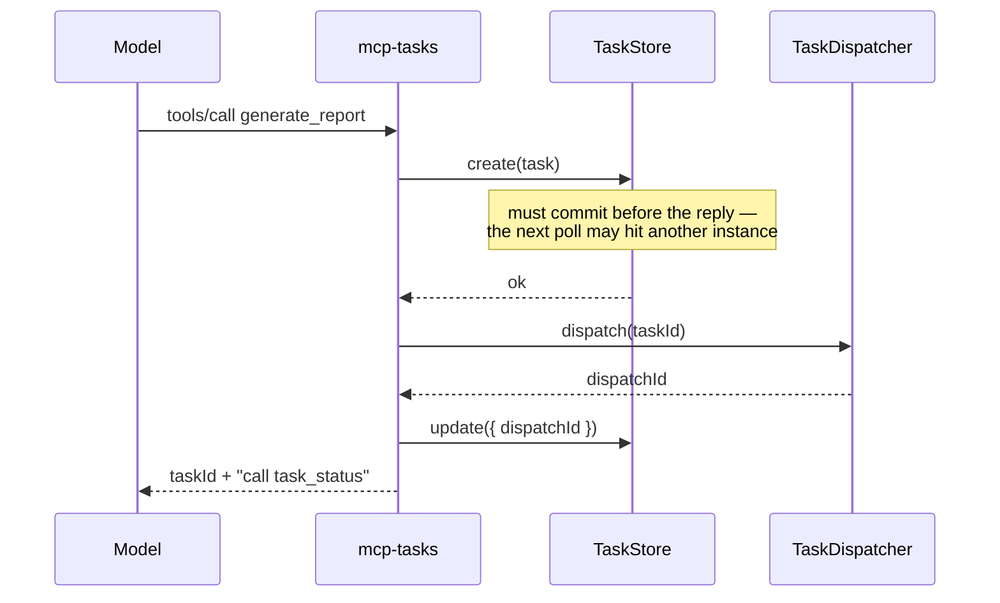
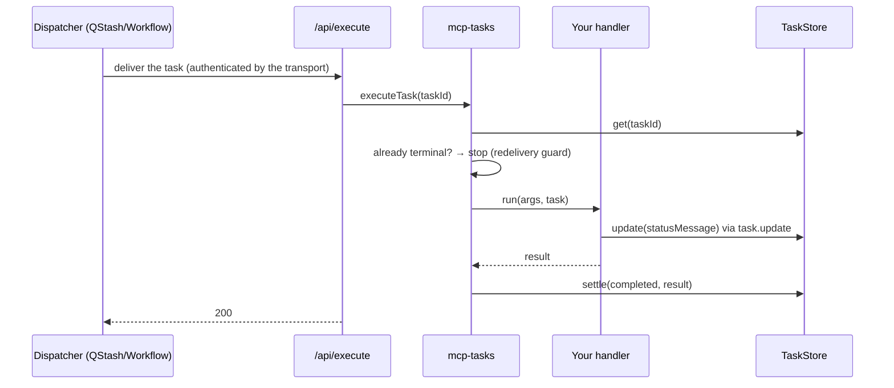
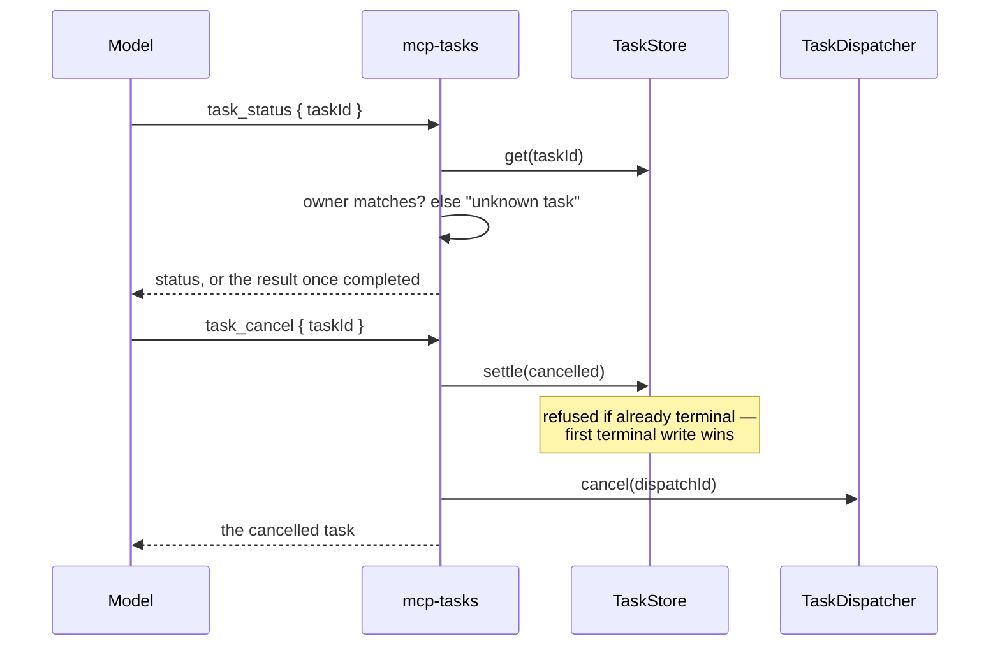

# @upstash/mcp-tasks

Durable long-running tools for MCP servers on the official TypeScript SDK.

A long-running tool answers immediately with a task id instead of blocking. The model polls a
shared `task_status` tool for progress and, once it completes, the result. The task record lives
in Upstash Redis; the work runs through QStash or Upstash Workflow, so it survives the process that
accepted the call, and it is not bound by your function's time limit or the client's tool timeout.

Everything is served as **ordinary MCP tools**, so it works in every client today — Claude Code,
Codex, Cursor, OpenCode, ChatGPT — with no client capability required. See
[Why tools, not the Tasks extension?](#why-tools-not-the-tasks-extension)

## Install

```bash
npm install @upstash/mcp-tasks @modelcontextprotocol/server @upstash/redis @upstash/qstash
```

## Usage

```ts
// lib/tasks.ts
import { McpServer } from "@modelcontextprotocol/server";
import { createTaskLayer } from "@upstash/mcp-tasks";
import { QStashDispatcher, RedisTaskStore } from "@upstash/mcp-tasks/upstash";
import * as z from "zod";

export const tasks = createTaskLayer({
  store: new RedisTaskStore(),
  dispatcher: new QStashDispatcher({ url: `${process.env.APP_URL}/api/execute` }),
});

export function createServer() {
  const server = new McpServer({ name: "reports", version: "1.0.0" });

  tasks.registerTask(
    server,
    "generate_report",
    { description: "Generates a report on a topic.", inputSchema: z.object({ topic: z.string() }) },
    async ({ topic }) => ({ content: [{ type: "text", text: await writeReport(topic) }] }),
  );

  return server;
}

// Registers the handler in every process, including an /api/execute instance that never serves an
// MCP request: the execute route finds a task's handler by the name stored on the task.
createServer();
```

Then two routes — the MCP endpoint, which is the SDK's own handler unchanged, and the one the work
is delivered to:

```ts
// app/api/mcp/route.ts
import { createMcpHandler } from "@modelcontextprotocol/server";
import { createServer } from "../../lib/tasks";

const handler = createMcpHandler(() => createServer());
export const POST = (request: Request) => handler.fetch(request);
```

```ts
// app/api/execute/route.ts
import { tasks } from "../../lib/tasks";

export const POST = tasks.createExecuteHandler();
```

That second route is deliberately not yours to write — the dispatcher owns it. See the
[FAQ](#faq) for what it does. Because the layer only registers tools, it works the same with
[`mcp-handler`](https://www.npmjs.com/package/mcp-handler) or any transport.

`tools/list` now shows three tools:

| Tool | What it does |
| --- | --- |
| `generate_report` | Starts the task and answers with its `taskId` at once |
| `task_status` | Progress while `working`; the handler's own result once `completed` |
| `task_cancel` | Asks the task to stop; idempotent |

`task_status` and `task_cancel` are shared by every task tool on the server.

<details>
<summary><b>Reporting progress and honouring cancellation</b></summary>

The handler's second argument is the task. Both calls are optional — a handler that ignores them
still works, it just reports nothing and cannot be stopped early.

```ts
async ({ topic }, task) => {
  for (const source of sources) {
    if (await task.isCancelled()) return {};
    await task.update(`Reading ${source}`);
    await read(source);
  }
  return { content: [{ type: "text", text: await writeReport(topic) }] };
};
```

`task.update(...)` is what the model sees as `statusMessage` on its next `task_status`.
Cancellation is cooperative: `task_cancel` flips the record and stops a pending delivery, but
running code only stops where it checks.

</details>

## Multi-user servers: set `principal`

Without it, anyone holding a task id can read and cancel that task. With it, each task records its
owner, and `task_status` / `task_cancel` answer only for the caller who started it — another
caller's id reads exactly like an unknown one.

```ts
const tasks = createTaskLayer({
  store: new RedisTaskStore(),
  dispatcher: new QStashDispatcher({ url: `${process.env.APP_URL}/api/execute` }),
  // Receives the AuthInfo your auth middleware attached to the request.
  principal: (auth) => auth?.extra?.userId as string | undefined,
});
```

Key on the *user*, not `auth.clientId`: the client id identifies the OAuth app, which is often one
id shared by every user of a host like ChatGPT.

## Retries without duplicates: `idempotencyKey`

Agents retry tool calls, especially ones that seemed to time out. Give a task tool an
`idempotencyKey`, and a second call from the same caller with the same key returns the existing
task instead of starting another:

```ts
tasks.registerTask(server, "generate_report", {
  description: "Generates a report on a topic.",
  inputSchema: z.object({ topic: z.string() }),
  idempotencyKey: ({ topic }) => topic,
}, handler);
```

Keys are scoped by caller and tool, and last as long as the task is retained (`ttlMs`). Return
`undefined` to opt a call out.

## What the model sees

```jsonc
// generate_report  →  a handle, immediately
{ "content": [{ "type": "text", "text": "Started task 0e30…. Call task_status with taskId \"0e30…\" in about 2s to check on it." }],
  "structuredContent": { "taskId": "0e30…", "status": "working", "ttlMs": 300000, "pollIntervalMs": 2000 } }

// task_status  →  progress…
{ "content": [{ "type": "text", "text": "Task 0e30… is working: Reading source 2. Check again in about 2s." }],
  "structuredContent": { "taskId": "0e30…", "status": "working", "statusMessage": "Reading source 2" } }

// …then the handler's own content, as if the tool had run synchronously
{ "content": [{ "type": "text", "text": "Task 0e30… is completed: Completed" },
              { "type": "text", "text": "Report on coffee" }],
  "structuredContent": { "taskId": "0e30…", "status": "completed", "result": { "content": [ … ] } } }
```

The states are `working`, `completed`, `failed` and `cancelled` (plus `input_required`, reserved);
the last three are terminal and never change again. The task object is the same shape as the
protocol's Tasks extension, so a native adapter can serve these records unchanged later.

## Choosing a dispatcher

Both serve the same route. They differ in how long the work may take.

| | `QStashDispatcher` | `WorkflowDispatcher` |
| --- | --- | --- |
| Runs off the `tools/call` request | ✅ | ✅ |
| Survives the process dying | ✅ redelivery | ✅ replay |
| Outlives one function invocation | ❌ | ✅ one invocation per step |
| Retries | whole task, from the start | per step, resuming from the journal |

A queue delivery is a single serverless invocation: exceed your platform's function limit and the
work is killed, and the redelivery restarts your handler from the beginning. Workflow gives each
step its own invocation and replays finished ones from a journal, so the task has no time limit.

**Start on QStash. Move to Workflow when the work outgrows a function.**

```ts
import { RedisTaskStore, WorkflowDispatcher } from "@upstash/mcp-tasks/upstash";
import type { WorkflowContext } from "@upstash/workflow";

const tasks = createTaskLayer<WorkflowContext>({
  store: new RedisTaskStore(),
  dispatcher: new WorkflowDispatcher({ url: `${process.env.APP_URL}/api/execute` }),
});
```

The type argument flows into `registerTask`, so the handler's context becomes
`TaskContext & WorkflowContext` — `task.update(...)` and the engine's `task.run(...)` on one object:

```ts
async ({ topic }, task) => {
  const data = await task.run("fetch", () => fetchSources(topic));
  await task.sleep("cool-off", 5);
  return { content: [{ type: "text", text: await task.run("write", () => summarise(data)) }] };
};
```

<details>
<summary><b>Writing a workflow handler: what goes inside a step</b></summary>

The handler is re-entered once per step, with finished steps replayed from the journal. So code
*outside* a step runs again on every invocation. Measured on the demo: **19 handler entries, each
step body executed exactly once.**

- **Work goes inside `task.run`.** That is what makes it survive, and what stops it re-running.
- **`task.update(...)` needs no wrapping.** The SDK journals its own writes.
- **`task.isCancelled()` stays outside.** It is a read, and it *must* re-run — a cached `false`
  would mean a cancel arriving later is never noticed.
- **Never nest steps.** The engine rejects `task.run` inside `task.run`.

</details>

## How it fits together

<details>
<summary><b>Who is responsible for what</b></summary>

| | Owns |
| --- | --- |
| **`@upstash/mcp-tasks`** | The tools: creating the record before replying, `task_status` / `task_cancel`, ownership and idempotency, the redelivery guard, settling `completed`/`cancelled` |
| **`TaskStore`** | Durability of the *record*: create-before-response, TTL, and the atomic terminal transition so a cancel and a completion cannot clobber each other |
| **`TaskDispatcher`** | Durability of the *work*: delivering it, retrying it, cancelling a pending delivery, authenticating its own endpoint, and deciding when a failure is final |
| **Your handler** | The work, and checking `isCancelled()` at step boundaries |

The split is the whole design: a durable task id does not make the underlying work durable.

</details>

<details>
<summary><b>Flow: starting a task</b></summary>


```mermaid
sequenceDiagram
    participant M as Model
    participant S as mcp-tasks
    participant St as TaskStore
    participant D as TaskDispatcher

    M->>S: tools/call generate_report
    S->>St: create(task)
    Note over St: must commit before the reply —<br/>the next poll may hit another instance
    St-->>S: ok
    S->>D: dispatch(taskId)
    D-->>S: dispatchId
    S->>St: update({ dispatchId })
    S-->>M: taskId + "call task_status"
```

</details>

<details>
<summary><b>Flow: the work running</b></summary>


```mermaid
sequenceDiagram
    participant D as Dispatcher (QStash/Workflow)
    participant E as /api/execute
    participant S as mcp-tasks
    participant H as Your handler
    participant St as TaskStore

    D->>E: deliver the task (authenticated by the transport)
    E->>S: executeTask(taskId)
    S->>St: get(taskId)
    S->>S: already terminal? → stop (redelivery guard)
    S->>H: run(args, task)
    H->>St: update(statusMessage) via task.update
    H-->>S: result
    S->>St: settle(completed, result)
    E-->>D: 200
```

If the handler throws, nothing is recorded and the endpoint answers **500** — that asks the
transport for another delivery. Only the transport settles `failed`, and only once it has stopped
retrying.

</details>

<details>
<summary><b>Flow: <code>task_status</code> and <code>task_cancel</code></b></summary>


```mermaid
sequenceDiagram
    participant M as Model
    participant S as mcp-tasks
    participant St as TaskStore
    participant D as TaskDispatcher

    M->>S: task_status { taskId }
    S->>St: get(taskId)
    S->>S: owner matches? else "unknown task"
    S-->>M: status, or the result once completed

    M->>S: task_cancel { taskId }
    S->>St: settle(cancelled)
    Note over St: refused if already terminal —<br/>first terminal write wins
    S->>D: cancel(dispatchId)
    S-->>M: the cancelled task
```

</details>

## Why tools, not the Tasks extension?

The 2026-07-28 spec defines a Tasks extension (`io.modelcontextprotocol/tasks`): a `tools/call`
answers with `resultType: "task"`, and the client polls `tasks/get`. It is the right long-term
shape — the *client* polls, so the model spends no turns on it. But a server must never return a
task to a client that has not declared the extension, and as of October 2026 none of the clients
people actually use do: not Claude Code, Codex, Cursor or OpenCode. Of the official SDKs only Rust
and C# implement it; TypeScript and Python have it on their roadmaps.

Plain tools trade some polling turns for working everywhere today. The model is told to poll, gets
a suggested interval, and receives the result in the same shape it would have synchronously.

The store and dispatcher do not care which surface sits on top. When clients declare the
extension, a native adapter can answer the same records over `tasks/get` / `tasks/cancel` for those
clients, and keep the tools for everyone else.

## Reference

<details>
<summary><b>The two interfaces</b></summary>

```ts
interface TaskStore {
  create(task: Task): Promise<void>;
  get(taskId: string): Promise<Task | null>;
  /** Ignored once the task is terminal — a late write must not overwrite "Cancelled by client". */
  update(taskId: string, patch: TaskPatch): Promise<Task>;
  /** Atomic. Returns null when the task was already terminal, so first terminal write wins. */
  settle(taskId: string, patch: TerminalTaskPatch): Promise<Task | null>;
}

interface TaskDispatcher<TContext = unknown> {
  dispatch(taskId: string): Promise<string | undefined>;
  cancel(dispatchId: string): Promise<void>;
  attach?(endpoints: TaskEndpoints<TContext>): void;
  createExecuteHandler?(): (request: Request) => Promise<Response>;
}
```

Implement both and the core does not change. A Postgres store is the same four methods over one
table with a cleanup job standing in for `PEXPIRE`; a BullMQ dispatcher is an `add` returning the
job id and a `remove` for cancel. `MemoryTaskStore` + `InlineTaskDispatcher` ship for tests —
neither is durable, which is exactly the failure this package is about.

</details>

<details>
<summary><b>Options</b></summary>

**`createTaskLayer`**

| | |
| --- | --- |
| `store`, `dispatcher` | Required. |
| `defaults.ttlMs` | Retention window, `null` for unlimited. Default 5 min. |
| `defaults.pollIntervalMs` | Poll interval suggested to the model. Default 2s. |
| `principal` | `(auth) => string \| undefined` — scopes tasks to their caller. Set it on any multi-user server. |
| `toolNames` | Rename `task_status` / `task_cancel`, e.g. to namespace them. |

**`registerTask` config** — `description`, `inputSchema`, plus optional `title`, `ttlMs`,
`pollIntervalMs`, `queuedMessage`, `completedMessage`, `idempotencyKey`.

**`RedisTaskStore`** — `redis` (defaults to `Redis.fromEnv()`), `prefix`, `enableTelemetry`.

**`QStashDispatcher`** — `url` required; `qstash`, `receiver`, `retries`, `retryDelay`, `headers`.

**`WorkflowDispatcher`** — `url` required; `client`, `headers`, `retries`.

</details>

<details>
<summary><b>Exports</b></summary>

| Export | What it is |
| --- | --- |
| `createTaskLayer(options)` | `{ registerTask, executeTask, failTask, createExecuteHandler, getTask, cancelTask, store, dispatcher }` |
| `TaskStore`, `TaskDispatcher`, `TaskContext` | The two seams, and what a handler is handed |
| `TaskEndpoints`, `TaskJournal` | What a dispatcher calls back into, and how it journals this package's own writes |
| `Task`, `WireTask`, `TaskStatus`, `TaskError` | The record, and the subset the model sees |
| `isTerminal`, `TERMINAL_STATUSES`, `UnknownTaskError` | Status helpers and the store's error type |
| `DEFAULT_TOOL_NAMES`, `CallerAuth` | `{ status: "task_status", cancel: "task_cancel" }`, and what `principal` receives |
| `MemoryTaskStore`, `InlineTaskDispatcher` | Non-durable backends for tests |
| `@upstash/mcp-tasks/upstash` | `RedisTaskStore`, `QStashDispatcher`, `WorkflowDispatcher` |

</details>

## FAQ

<details>
<summary><b>What does the execute endpoint actually do?</b></summary>

Whatever its transport needs — which is the reason the dispatcher hands you a finished endpoint
instead of a checklist. Authenticating a delivery, recognising its shapes and answering in the
codes it understands are all facts about the transport, not about your application. So the answer
differs by dispatcher:

**`QStashDispatcher`** serves the route itself. It authenticates each delivery by verifying the
QStash signature — against the URL you published to rather than `request.url`, since behind a proxy
the incoming URL is the internal one while QStash signed the public destination. It tells a normal
delivery (`{ taskId }`) from a failure callback (carries `sourceBody`, fires only once every retry
is exhausted). And it picks the status code, which *is* the retry contract: **200** ran or already
terminal, **500** the handler threw so try again, **401** bad signature and **400** an unusable
body — both terminal, because a retry cannot fix either.

**`WorkflowDispatcher`** returns the Workflow engine's own `serve()` handler. Authentication,
replay and step journaling are the engine's, so there is nothing here to get wrong by hand; it adds
only the failure hook that settles the task once a run has exhausted its retries.

A dispatcher that runs work in-process — `InlineTaskDispatcher` — has no endpoint at all, and
`createExecuteHandler()` throws to say so.

</details>

<details>
<summary><b>Won't the model give up polling?</b></summary>

Sometimes, which is why every response says what to do next in words — "call `task_status` in
about 2s" — and `task_status` tells the model not to start the task again. If it does start it
again, `idempotencyKey` turns the retry into a read of the existing task. Nothing is lost if the
model stops polling: the work finishes anyway, and the result stays readable until the task's TTL.

</details>

<details>
<summary><b>How long do retries last, and what if they run out?</b></summary>

The retry budget has to outlast whatever killed the process — otherwise the record survives while
nothing finishes the work, and the task sits at `working` until its TTL.

QStash caps `retries` per plan: the local dev server and the free tier reject anything above **5**
with `quota maxRetries exceeded`. So the budget is bought with backoff instead — the default delay
is `min(pow(3, retried) * 1000, 300000)`, about two minutes across five attempts.

When they do run out, QStash calls its failure callback and the task settles `failed` with the DLQ
id and the failed response attached. The message is in the QStash DLQ, not lost.

</details>

<details>
<summary><b>Is the task id a secret?</b></summary>

Without `principal`, effectively yes: ids are random (~122 bits for `randomUUID`), but anyone who
learns one can read *and cancel* that task. With `principal` set, an id is useless to anyone but
its owner. Idempotent task ids are a hash of caller, tool and key, so they are not guessable either.

</details>

## Not implemented

- `input_required` — a handler asking the user something mid-task. It would be the same shape:
  write the question into the record, let the handler read the answer at a step boundary.
- Listing tasks. Deliberately absent: without sessions, a list is only safe once scoped by
  `principal`, and the model rarely needs it.
- A native Tasks-extension adapter and an MCP Events bridge (push a `task.completed` event instead
  of polling). Both sit on the same store; they wait on client support.
