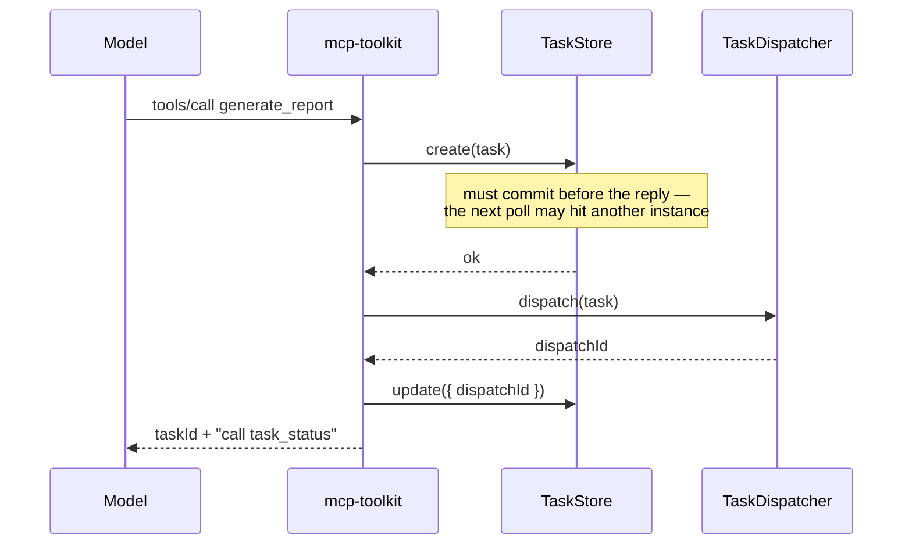
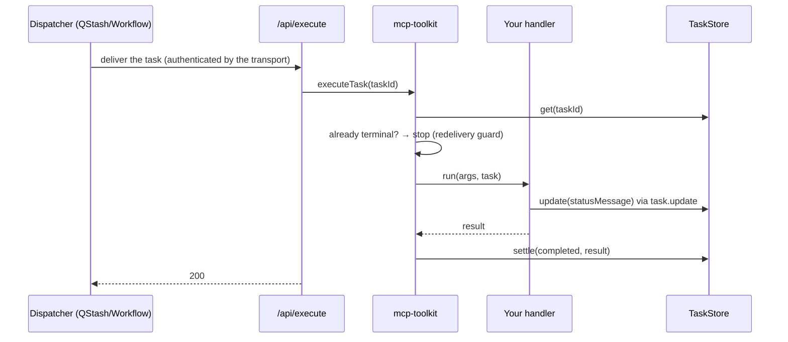
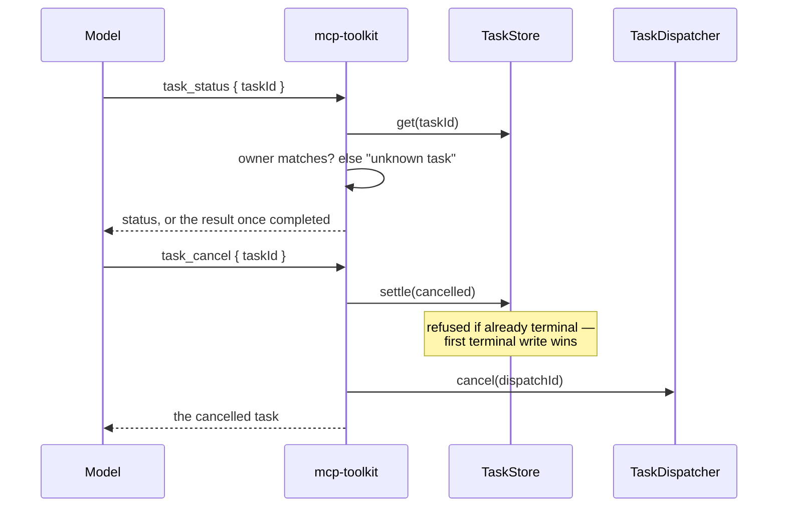

# @upstash/mcp-toolkit

Durable building blocks for MCP servers on the official TypeScript SDK, backed by Upstash Redis,
QStash and Workflow.

| Entry point                                                           | What it gives your server                                                                                                                                  |
| --------------------------------------------------------------------- | ---------------------------------------------------------------------------------------------------------------------------------------------------------- |
| [`@upstash/mcp-toolkit/tasks`](#tasks-long-running-tools)             | **Long-running tools.** A tool answers at once with a task id; the model polls `task_status` for progress and the result. Works in every client today.     |
| [`@upstash/mcp-toolkit/events`](#events-webhooks-that-wake-the-agent) | **MCP Events.** Hosts subscribe to your events and get a signed webhook when one happens, so an agent wakes up instead of polling. Works in ChatGPT today. |

`/tasks` keeps its Upstash backends behind `/tasks/upstash`; `/events` ships them in the same
entry point. Both include in-memory backends for tests. They also compose: a `task.finished` event tells an
event-capable host that a task settled, so it can skip polling.

## Install

```bash
npm install @upstash/mcp-toolkit @modelcontextprotocol/server @upstash/redis @upstash/qstash
```

`@upstash/workflow` is only needed for `WorkflowDispatcher`. The package uses WebCrypto only, so it
runs on Node and on edge runtimes.

## Tasks: long-running tools

A long-running tool answers immediately with a task id instead of blocking. The model polls a
shared `task_status` tool for progress and, once it completes, the result. The task record lives
in Upstash Redis; the work runs through QStash or Upstash Workflow, so it survives the process that
accepted the call and is not bound by the client's tool-call timeout. With QStash the handler still
runs inside one function invocation; [Workflow](#choosing-a-dispatcher) lifts that limit.

Everything is served as **ordinary MCP tools**, so it works in every client today — Claude Code,
Codex, Cursor, OpenCode, ChatGPT — with no client capability required. See
[Why tools, not the Tasks extension?](#why-tools-not-the-tasks-extension)

### Usage

```ts
// lib/tasks.ts
import { McpServer } from "@modelcontextprotocol/server";
import { createTaskLayer } from "@upstash/mcp-toolkit/tasks";
import { QStashDispatcher, RedisTaskStore } from "@upstash/mcp-toolkit/tasks/upstash";
import * as z from "zod";

export const tasks = createTaskLayer({
  store: new RedisTaskStore(),
  dispatcher: new QStashDispatcher({ url: `${process.env.APP_URL}/api/execute` }),
  // Who is calling: your user id from the request's auth. Required — see below.
  principal: ({ auth }) => auth?.extra?.userId as string | undefined,
});

// Module scope: every instance knows the handler, including an /api/execute instance that never
// serves an MCP request — the execute route finds a task's handler by the name stored on the task.
tasks.define(
  "generate_report",
  { description: "Generates a report on a topic.", inputSchema: z.object({ topic: z.string() }) },
  async ({ topic }) => ({ content: [{ type: "text", text: await writeReport(topic) }] }),
);

// Per request: attach every defined task tool, plus task_status and task_cancel.
export function createServer() {
  const server = new McpServer({ name: "reports", version: "1.0.0" });
  tasks.register(server);
  return server;
}
```

Then two routes — the MCP endpoint, which is the SDK's own handler unchanged, and the one the work
is delivered to:

```ts
// app/api/mcp/route.ts
import { createMcpHandler } from "@modelcontextprotocol/server";
import { createServer } from "../../lib/tasks";

const handler = createMcpHandler(() => createServer());
export const POST = (request: Request) => handler.fetch(request);
```

```ts
// app/api/execute/route.ts
import { tasks } from "../../lib/tasks";

export const POST = tasks.createExecuteHandler();
```

That second route is deliberately not yours to write — the dispatcher owns it. See the
[FAQ](#faq) for what it does. Because the layer only registers tools, it works the same with
[`mcp-handler`](https://www.npmjs.com/package/mcp-handler) or any transport.

`tools/list` now shows three tools:

| Tool              | What it does                                                        |
| ----------------- | ------------------------------------------------------------------- |
| `generate_report` | Starts the task and answers with its `taskId` at once               |
| `task_status`     | Progress while `working`; the handler's own result once `completed` |
| `task_cancel`     | Asks the task to stop; idempotent                                   |

`task_status` and `task_cancel` are shared by every task tool on the server.

<details>
<summary><b>Reporting progress and honouring cancellation</b></summary>

The handler's second argument is the task. Both calls are optional — a handler that ignores them
still works, it just reports nothing and cannot be stopped early.

```ts
async ({ topic }, task) => {
  for (const source of sources) {
    if (await task.isCancelled()) return {};
    await task.update(`Reading ${source}`);
    await read(source);
  }
  return { content: [{ type: "text", text: await writeReport(topic) }] };
};
```

`task.update(...)` is what the model sees as `statusMessage` on its next `task_status`.
Cancellation is cooperative: `task_cancel` flips the record and stops a pending delivery, but
running code only stops where it checks.

</details>

### Who is calling: `principal`

`principal` is required. It maps each call to a stable caller id, usually your user id. Each task
records it as its owner, and `task_status` / `task_cancel` answer only for the caller who started
the task; another caller's id reads exactly like an unknown one. The same function owns event
subscriptions.

It receives `{ auth, request }`:

- **`auth`** is the MCP SDK's `AuthInfo`: `{ token, clientId, scopes, expiresAt?, extra? }`. The
  SDK never fills it in from headers. **Your route does**, after verifying the bearer token with
  your OAuth provider, by passing it to the handler:

  ```ts
  // app/api/mcp/route.ts
  export async function POST(request: Request) {
    const authInfo = await verifyToken(request); // Clerk, WorkOS, Auth0, your own
    if (!authInfo) return new Response("Unauthorized", { status: 401 });
    return handler.fetch(request, { authInfo });
  }
  ```

  `extra` is free-form: put the user id there in `verifyToken`, and read it back with
  `principal: ({ auth }) => auth?.extra?.userId as string | undefined`. Because the token was
  already checked, this is the path to prefer.

- **`request`** is the raw HTTP request, for apps that authenticate with a cookie or session
  instead of an `AuthInfo`. It is unverified, so check the session yourself (`principal` may be
  async), and never trust a header like `x-user-id` that the caller can set.

There is no anonymous mode. When `principal` returns `undefined`, the call is refused with "Not
authenticated". A server with no users of its own (a local tool, a demo) says so explicitly:

```ts
principal: () => "local",
```

Key on the _user_, not `auth.clientId`: the client id identifies the OAuth app, which is often one
id shared by every user of a host like ChatGPT.

### Retries without duplicates: `idempotencyKey`

Agents retry tool calls, especially ones that seemed to time out. Give a task tool an
`idempotencyKey`, and a second call from the same caller with the same key returns the existing
task instead of starting another:

```ts
tasks.define(
  "generate_report",
  {
    description: "Generates a report on a topic.",
    inputSchema: z.object({ topic: z.string() }),
    idempotencyKey: ({ topic }) => topic,
  },
  handler,
);
```

Keys are scoped by caller and tool, and last as long as the task is retained (`ttlMs`). Return
`undefined` to opt a call out.

### What the model sees

```jsonc
// generate_report  →  a handle, immediately
{ "content": [{ "type": "text", "text": "Started task 0e30…. Call task_status with taskId \"0e30…\" in about 2s to check on it." }],
  "structuredContent": { "taskId": "0e30…", "status": "working", "ttlMs": 300000, "pollIntervalMs": 2000 } }

// task_status  →  progress…
{ "content": [{ "type": "text", "text": "Task 0e30… is working: Reading source 2. Check again in about 2s." }],
  "structuredContent": { "taskId": "0e30…", "status": "working", "statusMessage": "Reading source 2" } }

// …then the handler's own content, as if the tool had run synchronously
{ "content": [{ "type": "text", "text": "Task 0e30… is completed: Completed" },
              { "type": "text", "text": "Report on coffee" }],
  "structuredContent": { "taskId": "0e30…", "status": "completed", "result": { "content": [ … ] } } }
```

The states are `working`, `completed`, `failed` and `cancelled` (plus `input_required`, reserved);
the last three are terminal and never change again. The task object is the same shape as the
protocol's Tasks extension, so a native adapter can serve these records unchanged later.

### Choosing a dispatcher

Both serve the same route. They differ in how long the work may take.

|                                   | `QStashDispatcher`         | `WorkflowDispatcher`                |
| --------------------------------- | -------------------------- | ----------------------------------- |
| Runs off the `tools/call` request | ✅                         | ✅                                  |
| Survives the process dying        | ✅ redelivery              | ✅ replay                           |
| Outlives one function invocation  | ❌                         | ✅ one invocation per step          |
| Retries                           | whole task, from the start | per step, resuming from the journal |

A queue delivery is a single serverless invocation: exceed your platform's function limit and the
work is killed, and the redelivery restarts your handler from the beginning. Workflow gives each
step its own invocation and replays finished ones from a journal, so the task has no time limit.

**Start on QStash. Move to Workflow when the work outgrows a function.** Three things change:

```ts
import { RedisTaskStore, WorkflowDispatcher } from "@upstash/mcp-toolkit/tasks/upstash";
import type { WorkflowContext } from "@upstash/workflow";

const tasks = createTaskLayer<WorkflowContext>({
  store: new RedisTaskStore(),
  dispatcher: new WorkflowDispatcher({ url: `${process.env.APP_URL}/api/execute` }),
  principal: ({ auth }) => auth?.extra?.userId as string | undefined,
  // The record's TTL runs from creation and is never extended. Once it passes, the record is gone
  // and `isCancelled()` returns true, so give long work a longer one than the 5-minute default.
  defaults: { ttlMs: 60 * 60 * 1000 },
});
```

1. The `createTaskLayer<WorkflowContext>` type argument.
2. The work wrapped in `task.run(...)` steps. Each step is still one invocation, so keep each step
   within your function limit.
3. A `ttlMs` longer than the work.

The type argument flows into `define`, so the handler's context becomes
`TaskContext & WorkflowContext` — `task.update(...)` and the engine's `task.run(...)` on one object:

```ts
async ({ topic }, task) => {
  const data = await task.run("fetch", () => fetchSources(topic));
  await task.sleep("cool-off", 5);
  return { content: [{ type: "text", text: await task.run("write", () => summarise(data)) }] };
};
```

<details>
<summary><b>Writing a workflow handler: what goes inside a step</b></summary>

The handler is re-entered once per step, with finished steps replayed from the journal. So code
_outside_ a step runs again on every invocation. Measured on the demo: **19 handler entries, each
step body executed exactly once.**

- **Work goes inside `task.run`.** That is what makes it survive, and what stops it re-running.
- **`task.update(...)` needs no wrapping.** The SDK journals its own writes.
- **`task.isCancelled()` stays outside.** It is a read, and it _must_ re-run — a cached `false`
  would mean a cancel arriving later is never noticed.
- **Never nest steps.** The engine rejects `task.run` inside `task.run`.

</details>

### How it fits together

<details>
<summary><b>Who is responsible for what</b></summary>

|                                  | Owns                                                                                                                                                             |
| -------------------------------- | ---------------------------------------------------------------------------------------------------------------------------------------------------------------- |
| **`@upstash/mcp-toolkit/tasks`** | The tools: creating the record before replying, `task_status` / `task_cancel`, ownership and idempotency, the redelivery guard, settling `completed`/`cancelled` |
| **`TaskStore`**                  | Durability of the _record_: create-before-response, TTL, and the atomic terminal transition so a cancel and a completion cannot clobber each other               |
| **`TaskDispatcher`**             | Durability of the _work_: delivering it, retrying it, cancelling a pending delivery, authenticating its own endpoint, and deciding when a failure is final       |
| **Your handler**                 | The work, and checking `isCancelled()` at step boundaries                                                                                                        |

The split is the whole design: a durable task id does not make the underlying work durable.

</details>

<details>
<summary><b>Flow: starting a task</b></summary>



</details>

<details>
<summary><b>Flow: the work running</b></summary>



If the handler throws, nothing is recorded and the endpoint answers **500** — that asks the
transport for another delivery. Only the transport settles `failed`, and only once it has stopped
retrying.

</details>

<details>
<summary><b>Flow: <code>task_status</code> and <code>task_cancel</code></b></summary>



</details>

### Why tools, not the Tasks extension?

The 2026-07-28 spec defines a Tasks extension (`io.modelcontextprotocol/tasks`): a `tools/call`
answers with `resultType: "task"`, and the client polls `tasks/get`. It is the right long-term
shape — the _client_ polls, so the model spends no turns on it. But a server must never return a
task to a client that has not declared the extension, and as of October 2026 none of the clients
people actually use do: not Claude Code, Codex, Cursor or OpenCode. Of the official SDKs only Rust
and C# implement it; TypeScript and Python have it on their roadmaps.

Plain tools trade some polling turns for working everywhere today. The model is told to poll, gets
a suggested interval, and receives the result in the same shape it would have synchronously.

The store and dispatcher do not care which surface sits on top. When clients declare the
extension, a native adapter can answer the same records over `tasks/get` / `tasks/cancel` for those
clients, and keep the tools for everyone else.

## Events: webhooks that wake the agent

[MCP Events](https://github.com/modelcontextprotocol/experimental-ext-triggers-events) is a draft
extension: the host subscribes to an event on your server and hands over a callback URL and a
signing secret; when the event happens, your server POSTs a signed envelope to that URL. ChatGPT
ships the webhook flavor ([OpenAI's guide](https://developers.openai.com/plugins/build/mcp-events)).

This entry point implements the server side: `events/list`, `events/subscribe` and
`events/unsubscribe` on your MCP endpoint, the signed verification challenge, deterministic
subscription ids, expiry and refresh, Standard Webhooks signing, and durable retried delivery.

### Usage

```ts
// lib/events.ts
import { createEventLayer, QStashDelivery, RedisSubscriptionStore } from "@upstash/mcp-toolkit/events";
import * as z from "zod";

export const events = createEventLayer({
  store: new RedisSubscriptionStore(),
  delivery: new QStashDelivery({ url: `${process.env.APP_URL}/api/events` }),
  // `secretKey` defaults to MCP_EVENTS_SECRET_KEY, which encrypts the hosts' signing secrets at
  // rest. There is no built-in default: generate one with `openssl rand -base64 32`.
  principal: ({ auth }) => auth?.extra?.userId as string | undefined, // required, as for tasks
});

export const commentCreated = events.define("comment.created", {
  description: "A new review comment was added to a document.",
  input: z.object({ documentId: z.string() }),
  payload: z.object({ documentId: z.string(), commentId: z.string(), text: z.string() }),
  // Required. Runs when a host subscribes or refreshes, and again before every delivery.
  authorize: (args, { principal }) => canRead(principal, args.documentId),
});
```

Register it next to your tools, and serve the route QStash delivers to:

```ts
// in createServer()
events.register(server);
```

```ts
// app/api/events/route.ts
import { events } from "../../lib/events";

export const POST = events.createDeliveryHandler();
```

Then emit from wherever the change happens — a route, a webhook from your own app, a job:

```ts
await commentCreated.emit({ documentId: "doc_123", commentId: "c_9", text: "Ship it?" });
```

`emit` is typed by the `payload` schema and validates against it. It finds every subscription whose
arguments match (here, everyone watching `doc_123`) and hands each one to QStash. Before each
delivery, `authorize` runs again for that subscriber, so someone who lost access to the document
stops getting its comments. The delivery route signs the
envelope with that subscriber's secret, POSTs it, and answers 500 when the callback failed so
QStash retries with backoff. Each attempt is signed fresh, and the event id stays the same, so the
host can drop duplicates.

### Matching

A subscription matches when every argument it gave equals the value emitted. Emitting
`{ repo: "a", branch: "main" }` reaches subscribers of `{ repo: "a" }`, of
`{ repo: "a", branch: "main" }`, and of `{}`.

The values come from the payload fields named in the input schema, so when the payload carries
every input field, `emit(payload)` needs nothing else. When it doesn't, the type of `emit` makes
`args` required, and a runtime check refuses an emit that has no value for a required input field,
so a filter can never silently match nothing:

```ts
const replyPosted = events.define("reply.posted", {
  description: "A reply was posted in a thread.",
  input: z.object({ threadId: z.string() }),
  payload: z.object({ text: z.string() }), // no threadId here
  authorize: (args, { principal }) => canReadThread(principal, args.threadId),
});

await replyPosted.emit({ text: "Agreed" }, { args: { threadId } }); // `args` is required
```

Pass `eventId` to make a repeated emit deduplicate, and `to` to narrow it to specific users:

```ts
await commentCreated.emit(payload, { to: ["alice", "carol"], eventId: comment.id });
```

For conditions exact matching cannot express, add `match: (args, payload) => boolean` to the
definition.

### Users and subscriptions

Three things decide who gets an event: the callback URL says **where**, the subscription's
arguments say **what**, and `authorize` says **who may**.

- **The host routes to its user.** Each subscription carries a callback URL and signing secret the
  host generated for it. ChatGPT sends a unique `connectors.api.openai.com/webhook/mcp-events/<id>`
  per monitor, so posting there reaches the right user. Your server never needs to know who the host
  user is.
- **`authorize` is required.** It runs on every subscribe and refresh, with `{ principal, auth,
  request }`, and again before every delivery with just the stored `principal` and `context`: the
  token is never stored, so there is no `auth` behind a delivery. An event any authenticated caller
  may hear says so with `authorize: () => true`.
- **`principal` can carry context.** Return `{ id, context }` instead of a string to store small,
  non-secret data (an org id, a role) on the subscription. `authorize` gets it back as
  `caller.context` at delivery time. It is a snapshot from subscribe time, so revocation checks
  should query your own data with `principal`.
- **Personal events use `to`.** Some events belong to one user, like "your export finished". Mark
  them `personal: true`, and every `emit` must say who with `to` (the type requires it, and so does
  a runtime check). A subscription with no arguments then only hears about its own user's events.
  `to` also works on ordinary events, to narrow one emit.
- **No anonymous subscriptions.** When `principal` returns `undefined`, subscribe and unsubscribe
  are refused with reason `not_authenticated`, before any challenge is sent. Only the subscriber
  can unsubscribe.

```ts
const exportFinished = events.define("export.finished", {
  description: "Your export finished.",
  payload: z.object({ exportId: z.string(), url: z.string() }),
  personal: true,
  authorize: () => true, // `to` already limits it to the export's owner
});

await exportFinished.emit({ exportId, url }, { to: userId });
```

### `task.finished`: tasks that push instead of being polled

```ts
import { createEventLayer, taskFinishedEvent } from "@upstash/mcp-toolkit/events";

const events = createEventLayer({
  /* … */
});
const taskFinished = taskFinishedEvent(events);

const tasks = createTaskLayer({ store, dispatcher, principal, onSettle: taskFinished.onSettle });
```

A host subscribes with no arguments to hear about every task its user starts, or with `taskId` for
one. The payload carries the status and, when it fits in the 256 KiB envelope, the result.
It is a personal event, emitted `to` the task's owner, so deliveries only go to their subscriptions.

### What the layer checks for you

- **The callback.** It must be `https` on a public host: `localhost`, single-label and `.internal`
  names, private, loopback and link-local IPs, and credentials in the URL are refused, and
  reserved and documentation ranges (including IPv4 embedded in IPv6) are refused, trailing dots
  included, and redirects are never followed. Before storing a subscription the server POSTs a
  signed challenge and requires it echoed back, reading at most 4 KB of the answer. Every failure
  answers the same `-32015`, so a subscriber cannot probe your network; the detail goes to your
  logs. The checks do not resolve DNS, so add egress filtering in production. Set
  `allowInsecureCallbacks` for local development only.
- **The secret.** `whsec_` plus 24–64 base64 bytes, stored AES-256-GCM encrypted under
  `secretKey`. A refresh with the same secret skips the challenge; a new one re-verifies.
- **Authorization.** `authorize` runs on every subscribe and refresh, and again before every
  delivery. A delivery it refuses is dropped, not retried.
- **Lifetime.** The host's `ttlMs` is granted up to `defaults.maxTtlMs` (30 days); `refreshBefore`
  tells it when to subscribe again.
- **Host answers.** `410` deletes the subscription, `413` and redirects drop the event, anything else
  retries.

### Who can subscribe today

As of October 2026, ChatGPT is the only widely used host that subscribes to MCP Events (webhook
mode, in Work chats). Codex supports events only for OpenAI's own connectors, and Claude Code,
Cursor and OpenCode do not subscribe yet. The demo's Deploy Watch server has been tested end to end
with ChatGPT monitors. Poll and stream delivery modes in the draft are not
implemented here; `events/subscribe` refuses them.

## Who can see what

Every guarantee below starts from `principal`. It runs on the server, on every request, and reads
the `AuthInfo` your route verified (or the request, for session apps). The caller never supplies an
owner or a subscriber id: no tool argument, subscription argument or header is trusted for it. So
the guarantees are only as good as `principal`: it must return the user (the token's subject), not
`auth.clientId`, which every user of a host like ChatGPT shares.

### Tasks: nobody can read or cancel another user's task

1. **The owner is set by the server.** When a task tool is called, the toolkit runs `principal`
   and stores the result as the task's `owner`. The model only sends the tool's own arguments, and
   there is no way to pass an owner. A caller `principal` cannot identify is refused before
   anything is stored.
2. **Every read checks it.** `task_status` and `task_cancel` run `principal` again, load the task,
   and compare its `owner` to the caller. Anything else gets the same answer as an id that never
   existed ("Unknown task"), so another user's id cannot even be confirmed to exist.
3. **Ids don't help.** Unkeyed ids are random UUIDs. Keyed ids hash the owner in, so the same
   `idempotencyKey` gives each user their own task and never someone else's.
4. **There is no other way in.** No tool lists tasks. The execute endpoint only accepts deliveries
   signed by QStash, and it runs the handler; it never returns a task to the caller.
5. **`task.finished` follows the same owner.** It is a personal event, emitted `to` the task's
   owner, so a task's result only reaches that user's subscriptions.

### Events: only users with access can subscribe

On every `events/subscribe`:

1. `principal` gives the subscriber. If it is `undefined`, the call is refused with
   `not_authenticated`.
2. The arguments are validated against the event's `input` schema.
3. `authorize(args, { principal, context, phase: "subscribe", auth, request })` runs. It is
   required on every event. If it says no, the call is refused with `not_authorized`. This happens
   **before** the callback is challenged and before anything is stored, so a refused caller costs
   one call and leaves nothing behind.
4. Only then is the callback verified and the subscription stored, with the subscriber's id in its
   record and in its id.

A refresh is a subscribe with the same arguments, so it goes through all four steps again. An
unsubscribe recomputes the subscription id from the caller's own principal, so a user can only ever
remove their own subscriptions.

### Events: deliveries only reach users who still have access

Subscribing was allowed once, but access changes. So the check runs again for every delivery:

1. **`emit` picks candidates.** It finds the subscriptions whose arguments match, and, when `to` is
   given, keeps only those users' subscriptions. A `personal` event cannot be emitted without `to`;
   the type requires it, and so does a runtime check. `emit` is your server code, never something a
   client calls.
2. **Each candidate is queued separately**, one QStash message per subscription.
3. **The delivery route checks again.** When QStash calls it, the route loads the subscription and
   runs `authorize(args, { principal: subscriber, context, phase: "deliver" })`. Because this
   happens at delivery time, not at `emit`, it also catches access removed between the two.
   - **No:** the event is dropped. Nothing is sent, and QStash does not retry it.
   - **Throws** (your database is down, say): the route answers 500 and QStash retries later, so a
     temporary failure never turns into a delivery.
   - **Yes:** the envelope is signed with that subscription's own secret and POSTed to that
     subscription's own callback URL.

At delivery there is no token or request (neither is ever stored), so `authorize` decides from the
stored subscriber id, the subscription's arguments and the optional `context`, by asking your own
data: "can this user still read this document?" Treat `context` as a snapshot from subscribe time;
revocation checks should look up the current state.

### What this does not cover

- **Your `authorize`.** The toolkit makes sure it runs; whether it is right is yours. An event with
  `authorize: () => true` reaches every authenticated subscriber whose arguments match.
- **Field-level redaction.** `authorize` lets a whole event through or not. Every recipient of an
  emit gets the same payload, so don't put data in it that only some of them may see; emit
  separately, with `to`, instead.
- **The Redis and QStash credentials.** Anyone who can write the stored records can change an owner
  or a callback URL. See [What lives in Redis](#what-lives-in-redis).

## What lives in Redis

Everything the toolkit keeps is in your Upstash Redis database, under two prefixes you can change
(`prefix` on each store). This section lists every key, what it is for, and what it means for
security and correctness. Treat the Redis credentials like any other production secret: whoever can
write these keys can change who owns a task or where an event goes.

### Tasks: one hash per task

`mcp:task:<taskId>` is a hash with one field per task property, each value JSON-encoded:

| Field | What it is |
| --- | --- |
| `taskId`, `name` | The task id, and the defined task (tool) name that picks the handler |
| `args` | The validated tool arguments, replayed into the handler on delivery |
| `owner` | The caller's id from `principal`, checked on every `task_status` / `task_cancel` |
| `status`, `statusMessage` | `working`, `completed`, `failed` or `cancelled`, and the progress line |
| `result` / `error` | The handler's tool result once `completed`, or the error once `failed` |
| `createdAt`, `lastUpdatedAt`, `ttlMs`, `pollIntervalMs` | Timing |
| `dispatchId` | The QStash message id or Workflow run id, so a cancel can stop pending deliveries |

**Security**

- `args` and `result` are **plain JSON**. Anyone who can read the database can read them, for as
  long as the task lives. Keep secrets out of tool arguments and results, or use a short `ttlMs`.
- `owner` is what keeps tasks apart. A task is only ever answered to the caller whose `principal`
  matches it; another caller's id reads as unknown. That is why `principal` must return the user
  (the token's subject), not `auth.clientId`.
- The caller's token, `AuthInfo` and request are **never stored**.
- The owner is not a separate part of the key; it is folded into the task id. A task without an
  `idempotencyKey` gets a random id (`crypto.randomUUID()`). A keyed task's id is the first 32 hex
  characters of `sha256(JSON.stringify([owner, tool, key]))`, so alice and bob calling
  `generate_report` with the same key get different ids, and so different records. Either way the
  stored `owner` field is checked again on every read.

**Correctness**

- **Durable before the reply.** The record is written before the tool answers with its id, because
  the model may poll from another instance right away. Creation is one Lua script that writes only
  if the key is absent, so two racing retries with the same key cannot both create a task, and a
  retry gets the existing task back.
- **First terminal write wins.** Progress updates and terminal transitions go through one guarded
  Lua script that refuses to touch a task that is already `completed`, `failed` or `cancelled`. A
  completion that lands after a cancel cannot overwrite it, and a late progress line cannot
  overwrite "Cancelled by client".
- **One field per property**, so a progress write and a cancel never clobber each other's fields.
- **TTL from creation.** `PEXPIRE` is set once, from `ttlMs` (5 minutes by default), and never
  extended. An expired task reads as unknown, and its handler's `isCancelled()` returns true. With
  `ttlMs: null` the record has no expiry and stays until you delete it.
- **Values are JSON-encoded on write**, so the client's automatic decoding is the exact inverse: a
  status message of `"123"` comes back as a string. A Redis client built with
  `automaticDeserialization: false` is not supported.

### Events: one key per subscription, one index per filter

`mcp-events:sub:<subscriptionId>` is a JSON string with the subscription:

| Field | What it is |
| --- | --- |
| `id` | `sub_` + a hash of subscriber, callback URL, event and arguments |
| `event`, `args`, `argsKey` | The event name, the subscriber's filter, and its canonical JSON |
| `url` | The callback URL the host gave, which every delivery for this subscription goes to |
| `encryptedSecret` | The host's `whsec_` signing secret, AES-256-GCM encrypted under `secretKey` |
| `subscriber` | The caller's id from `principal` |
| `context` | Optional non-secret context `principal` returned, at most 4 KB |
| `createdAt`, `expiresAt` | Timing |

`mcp-events:idx:<event>:<hash of argsKey>` is a sorted set of subscription ids scored by expiry,
so an emit reads only the subscriptions its arguments can match.

**Security**

- **The signing secret is encrypted** with `secretKey` (`MCP_EVENTS_SECRET_KEY`), which is never
  stored in Redis. A leaked database does not let anyone forge webhooks to the hosts. Rotating the
  key makes stored secrets unreadable; those subscriptions stop receiving events until the host
  refreshes and re-verifies.
- **No token is stored.** That is why `authorize` before a delivery only gets the stored
  `subscriber` and `context`, never `auth`. Put only non-secret data (an org id, a role) in
  `context`.
- **Callback URLs are visible** to anyone who can read the database. They are host-generated and
  only accept requests signed with the encrypted secret.
- **Where vs who.** The callback URL says where a delivery goes; `subscriber` plus `authorize` say
  who may receive it. One user connected through two hosts has two subscriptions with two URLs and
  two secrets, so a delivery for one host is never sent to the other.
- A subscription is stored only after `authorize` allows it and the callback echoed a signed
  challenge. Unsubscribing recomputes the id from the caller's own principal, so only the
  subscriber can remove it.

**Correctness**

- **Expiry.** The subscription key expires with the subscription (`PX`), and the index is written in
  the same Lua script, kept alive as long as its longest-lived member, with expired members pruned
  on every write. Reads only take index entries scored in the future.
- **Deterministic ids.** Subscribing again with the same subscriber, URL, event and arguments
  updates the same record (a refresh) instead of creating a duplicate.
- **Bounded lookups.** An emit reads one index per subset of its arguments (at most 256), then the
  matching records, in requests of at most 1,000 commands.

### Not in Redis, but worth knowing

- **QStash messages.** A task delivery carries only `{ taskId }`. An event delivery carries the
  subscription id and the full event envelope, including its payload, so the payload sits in QStash
  (and its DLQ, if every retry fails) until it is delivered.
- **Deduplication keys.** Task dispatches dedupe on `taskId` plus creation time, and event deliveries
  on event id plus subscription id. Re-creating an expired keyed task gets a new key, so QStash's
  10-minute dedup window never swallows it.
- **Never stored anywhere by the toolkit:** the caller's token or `AuthInfo`, the raw request, the
  plaintext webhook secret, and `MCP_EVENTS_SECRET_KEY`.

## Reference

<details>
<summary><b>The task interfaces</b></summary>

```ts
interface TaskStore {
  /** Create-if-absent, atomically. Returns the existing task when the id is taken, else null. */
  create(task: Task): Promise<Task | null>;
  get(taskId: string): Promise<Task | null>;
  /** Ignored once the task is terminal — a late write must not overwrite "Cancelled by client". */
  update(taskId: string, patch: TaskPatch): Promise<Task>;
  /** Atomic, first terminal write wins. `settled` is true only for the call that made the move. */
  settle(taskId: string, patch: TerminalTaskPatch): Promise<{ task: Task; settled: boolean } | null>;
}

interface TaskDispatcher<TContext = unknown> {
  /** Dedupe on `dispatchKey(task)`: a keyed task id comes back once its record expires. */
  dispatch(task: Task): Promise<string | undefined>;
  cancel(dispatchId: string): Promise<void>;
  attach?(endpoints: TaskEndpoints<TContext>): void;
  createExecuteHandler?(): (request: Request) => Promise<Response>;
}
```

Implement both and the core does not change. A Postgres store is the same four methods over one
table with a cleanup job standing in for `PEXPIRE`; a BullMQ dispatcher is an `add` returning the
job id and a `remove` for cancel. `MemoryTaskStore` + `InlineTaskDispatcher` ship for tests —
neither is durable, which is exactly the failure this package is about.

</details>

<details>
<summary><b>Options: tasks</b></summary>

**`createTaskLayer`**

|                           |                                                                                                             |
| ------------------------- | ----------------------------------------------------------------------------------------------------------- |
| `store`, `dispatcher`     | Required.                                                                                                   |
| `principal`               | Required. `({ auth, request }) => string \| undefined`, may be async — the caller's id; `undefined` refuses the call.                  |
| `defaults.ttlMs`          | Retention window, `null` for unlimited. Default 5 min.                                                      |
| `defaults.pollIntervalMs` | Poll interval suggested to the model. Default 2s.                                                           |
| `toolNames`               | Rename `task_status` / `task_cancel`, e.g. to namespace them.                                               |
| `onSettle`                | `(task) => void` — called once when a task completes, fails or is cancelled. Wire `taskFinishedEvent` here. |

**`define(name, config, handler)` config** — `description`, `inputSchema`, plus optional `title`, `ttlMs`,
`pollIntervalMs`, `queuedMessage`, `completedMessage`, `idempotencyKey`.

**`RedisTaskStore`** — `redis` (defaults to `Redis.fromEnv()`; `automaticDeserialization: false`
is not supported), `prefix`, `enableTelemetry`.

**Data at rest.** See [What lives in Redis](#what-lives-in-redis).

**`QStashDispatcher`** — `url` required; `qstash`, `receiver`, `retries`, `retryDelay`, `headers`,
`enableTelemetry`.

**`WorkflowDispatcher`** — `url` required; `client`, `qstash`, `receiver`, `headers`, `retries`,
`enableTelemetry`.

**Signing keys are required.** Every delivery endpoint (`QStashDispatcher`, `WorkflowDispatcher`,
`QStashDelivery`) verifies QStash's signature with `receiver`, or with a `Receiver` built from
`QSTASH_CURRENT_SIGNING_KEY` and `QSTASH_NEXT_SIGNING_KEY`. With neither, the endpoint throws on
its first request; it never runs a delivery unverified. This matters most for Workflow, whose own
`serve()` skips verification when the env vars are missing.

**Telemetry.** The Redis, QStash and Workflow clients the toolkit builds or receives get
`@upstash/mcp-toolkit@<version>` appended to their `Upstash-Telemetry-Sdk` header, the same way
the other Upstash SDKs report. Opt out per backend with `enableTelemetry: false`, on the client
itself, or with `UPSTASH_DISABLE_TELEMETRY`.

</details>

<details>
<summary><b>Exports: <code>/tasks</code></b></summary>

| Export                                                | What it is                                                                                              |
| ----------------------------------------------------- | ------------------------------------------------------------------------------------------------------- |
| `createTaskLayer(options)`                            | `{ define, register, createExecuteHandler, getTask, cancelTask }`                                       |
| `TaskStore`, `TaskDispatcher`, `TaskContext`          | The two seams, and what a handler is handed                                                             |
| `TaskEndpoints`, `TaskJournal`, `dispatchKey`         | What a dispatcher calls back into, how it journals this package's writes, and the key it dedupes on     |
| `SettleResult`, `PrincipalResolver`                   | What `settle` returns, and the type of `principal`                                                      |
| `Task`, `WireTask`, `TaskStatus`, `TaskError`         | The record, and the subset the model sees                                                               |
| `isTerminal`, `TERMINAL_STATUSES`, `UnknownTaskError` | Status helpers and the store's error type                                                               |
| `DEFAULT_TOOL_NAMES`, `Caller`, `CallerAuth`          | `{ status: "task_status", cancel: "task_cancel" }`, and what `principal` receives                       |
| `MemoryTaskStore`, `InlineTaskDispatcher`             | Non-durable backends for tests                                                                          |
| `@upstash/mcp-toolkit/tasks/upstash`                  | `RedisTaskStore`, `QStashDispatcher`, `WorkflowDispatcher`                                              |

</details>

<details>
<summary><b>The event interfaces</b></summary>

```ts
interface SubscriptionStore {
  put(subscription: Subscription): Promise<void>;
  get(id: string): Promise<Subscription | null>;
  /** Gets the index coordinates along with the id, so it needs no read first. */
  delete(subscription: Pick<Subscription, "id" | "event" | "argsKey">): Promise<void>;
  /** Every live subscription to `event` whose canonical arguments are one of `argsKeys`. */
  find(event: string, argsKeys: string[]): Promise<Subscription[]>;
}

interface EventDelivery {
  enqueue(jobs: DeliveryJob[]): Promise<void>;
  attach?(endpoints: { send(job: DeliveryJob): Promise<SendOutcome> }): void;
  createDeliveryHandler?(): (request: Request) => Promise<Response>;
}
```

`RedisSubscriptionStore` keeps one expiring key per subscription and a sorted set per
`(event, arguments)` scored by expiry, so an emit reads only what it can match, in batches of at
most 1,000 commands.
`MemorySubscriptionStore` + `InlineDelivery` (sends in-process, no retries) ship for tests.

</details>

<details>
<summary><b>Options: events</b></summary>

**`createEventLayer`**

|                                        |                                                                                                                  |
| -------------------------------------- | ---------------------------------------------------------------------------------------------------------------- |
| `store`, `delivery`                    | Required.                                                                                                        |
| `secretKey`                            | Encrypts stored signing secrets. Defaults to `MCP_EVENTS_SECRET_KEY`; required, no built-in default.             |
| `principal`                            | Required. `({ auth, request }) => id \| { id, context } \| undefined`, may be async — the subscriber; `undefined` refuses. |
| `defaults.ttlMs` / `defaults.maxTtlMs` | Granted lifetime when none is asked for (7 days), and the cap (30 days).                                         |
| `allowInsecureCallbacks`               | Accept `http://` and private hosts. Local development only.                                                      |
| `timeoutMs`                            | Per-POST timeout. Default 10s.                                                                                   |

**`define` config** — `description`, `payload` and `authorize` (required), plus optional `title`,
`input`, `personal` and `match`.

**`RedisSubscriptionStore`** — `redis`, `prefix` (default `mcp-events:`), `enableTelemetry`.

**`QStashDelivery`** — `url` required; `qstash`, `receiver`, `retries` (default 3), `retryDelay`, `headers`,
`enableTelemetry`.

</details>

<details>
<summary><b>Exports: <code>/events</code></b></summary>

| Export                                                                      | What it is                                                                 |
| --------------------------------------------------------------------------- | -------------------------------------------------------------------------- |
| `createEventLayer(options)`                                                 | `{ define, register, createDeliveryHandler, list }`                        |
| `taskFinishedEvent(events)`                                                 | `{ event, onSettle }` — the bridge from tasks                              |
| `SubscriptionStore`, `EventDelivery`, `Subscription`, `EventEnvelope`       | The two seams and the records                                              |
| `signWebhook`, `verifyWebhook`                                              | Standard Webhooks signing, and verification for writing a receiver         |
| `callbackUrlProblem`, `decodeSecret`, `SecretBox`                           | The callback, secret and encryption checks the layer uses                  |
| `EventPayloadTooLargeError`, `CALLBACK_ENDPOINT_ERROR`, `MAX_PAYLOAD_BYTES` | Limits and errors                                                          |
| `AuthorizeCaller`, `Recipients`, `Principal`, `EmitOptions`                 | What `authorize` is told, what `to` takes, what `principal` returns         |
| `MemorySubscriptionStore`, `InlineDelivery`                                 | Non-durable backends for tests                                             |
| `RedisSubscriptionStore`, `QStashDelivery` | The Upstash backends (need `@upstash/redis` and `@upstash/qstash`) |

</details>

## FAQ

<details>
<summary><b>What does the execute endpoint actually do?</b></summary>

Whatever its transport needs — which is the reason the dispatcher hands you a finished endpoint
instead of a checklist. Authenticating a delivery, recognising its shapes and answering in the
codes it understands are all facts about the transport, not about your application. So the answer
differs by dispatcher:

**`QStashDispatcher`** serves the route itself. It authenticates each delivery by verifying the
QStash signature — against the URL you published to rather than `request.url`, since behind a proxy
the incoming URL is the internal one while QStash signed the public destination. It tells a normal
delivery (`{ taskId }`) from a failure callback (carries `sourceBody`, fires only once every retry
is exhausted). And it picks the status code, which _is_ the retry contract: **200** ran or already
terminal, **500** the handler threw so try again, and **489** with `Upstash-NonRetryable-Error` for
a bad signature or an unusable body. QStash retries every other non-2xx, and a retry cannot fix
either of those.

**`WorkflowDispatcher`** returns the Workflow engine's own `serve()` handler. Authentication,
replay and step journaling are the engine's, so there is nothing here to get wrong by hand; it adds
only the failure hook that settles the task once a run has exhausted its retries.

A dispatcher that runs work in-process — `InlineTaskDispatcher` — has no endpoint at all, and
`createExecuteHandler()` throws to say so.

</details>

<details>
<summary><b>Won't the model give up polling?</b></summary>

Sometimes, which is why every response says what to do next in words — "call `task_status` in
about 2s" — and `task_status` tells the model not to start the task again. If it does start it
again, `idempotencyKey` turns the retry into a read of the existing task. Nothing is lost if the
model stops polling: the work finishes anyway, and the result stays readable until the task's TTL.

</details>

<details>
<summary><b>How long do retries last, and what if they run out?</b></summary>

The retry budget has to outlast whatever killed the process — otherwise the record survives while
nothing finishes the work, and the task sits at `working` until its TTL.

QStash caps `retries` per plan: the local dev server and the free tier reject anything above **5**
with `quota maxRetries exceeded`. So the budget is bought with backoff instead — the default delay
is `min(pow(3, retried) * 1000, 300000)`, about two minutes across five attempts.

When they do run out, QStash calls its failure callback and the task settles `failed` with the DLQ
id and the failed response attached. The message is in the QStash DLQ, not lost.

</details>

<details>
<summary><b>Is the task id a secret?</b></summary>

No. Every task is scoped to the `principal` that started it, so an id is useless to anyone but its
owner. Ids are also random (~122 bits for `randomUUID`), and idempotent task ids are a hash of
caller, tool and key, so they are not guessable either.

</details>

## Not implemented

- `input_required` — a handler asking the user something mid-task. It would be the same shape:
  write the question into the record, let the handler read the answer at a step boundary.
- Listing tasks. Deliberately absent: the model rarely needs it, and a list adds an index to keep
  consistent with every expiry.
- A native Tasks-extension adapter. It sits on the same store; it waits on client support.
- Event replay (`cursor`), and the draft's poll and stream delivery modes. Subscriptions always
  answer `cursor: null, truncated: false`.
