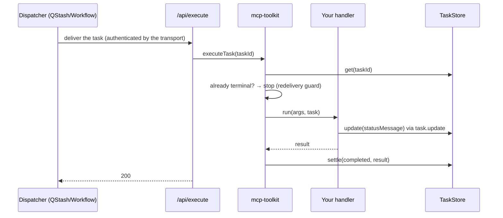
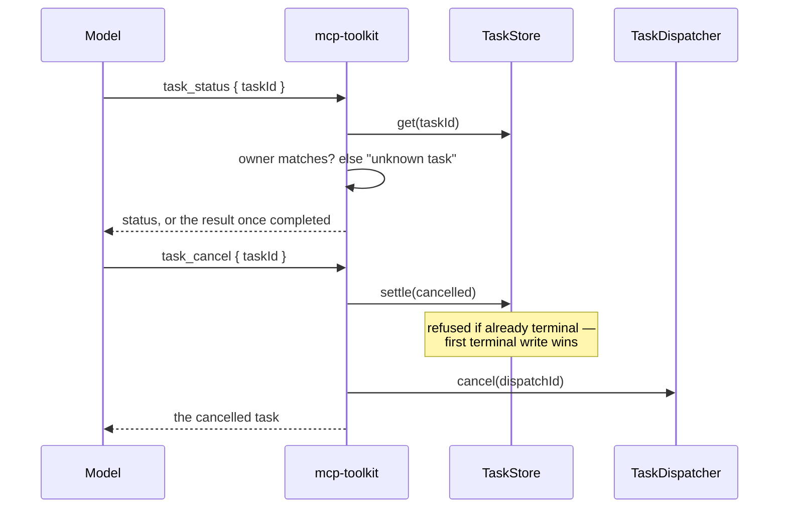

# @upstash/mcp-toolkit

Durable building blocks for MCP servers on the official TypeScript SDK, backed by Upstash Redis,
QStash and Workflow.

| Entry point                                                           | What it gives your server                                                                                                                                  |
| --------------------------------------------------------------------- | ---------------------------------------------------------------------------------------------------------------------------------------------------------- |
| [`@upstash/mcp-toolkit/tasks`](#tasks-long-running-tools)             | **Long-running tools.** A tool answers at once with a task id; the model polls `task_status` for progress and the result. Works in every client today.     |
| [`@upstash/mcp-toolkit/events`](#events-webhooks-that-wake-the-agent) | **MCP Events.** Hosts subscribe to your events and get a signed webhook when one happens, so an agent wakes up instead of polling. Works in ChatGPT today. |

`/tasks` keeps its Upstash backends behind `/tasks/upstash`; `/events` ships them in the same
entry point. Both include in-memory backends for tests. They also compose: a `task.finished` event tells an
event-capable host that a task settled, so it can skip polling.

## Install

```bash
npm install @upstash/mcp-toolkit @modelcontextprotocol/server @upstash/redis @upstash/qstash
```

`@upstash/workflow` is only needed for `WorkflowDispatcher`.

## Tasks: long-running tools

A long-running tool answers immediately with a task id instead of blocking. The model polls a
shared `task_status` tool for progress and, once it completes, the result. The task record lives
in Upstash Redis; the work runs through QStash or Upstash Workflow, so it survives the process that
accepted the call, and it is not bound by your function's time limit or the client's tool timeout.

Everything is served as **ordinary MCP tools**, so it works in every client today — Claude Code,
Codex, Cursor, OpenCode, ChatGPT — with no client capability required. See
[Why tools, not the Tasks extension?](#why-tools-not-the-tasks-extension)

### Usage

```ts
// lib/tasks.ts
import { McpServer } from "@modelcontextprotocol/server";
import { createTaskLayer } from "@upstash/mcp-toolkit/tasks";
import { QStashDispatcher, RedisTaskStore } from "@upstash/mcp-toolkit/tasks/upstash";
import * as z from "zod";

export const tasks = createTaskLayer({
  store: new RedisTaskStore(),
  dispatcher: new QStashDispatcher({ url: `${process.env.APP_URL}/api/execute` }),
});

export function createServer() {
  const server = new McpServer({ name: "reports", version: "1.0.0" });

  tasks.registerTask(
    server,
    "generate_report",
    { description: "Generates a report on a topic.", inputSchema: z.object({ topic: z.string() }) },
    async ({ topic }) => ({ content: [{ type: "text", text: await writeReport(topic) }] }),
  );

  return server;
}

// Registers the handler in every process, including an /api/execute instance that never serves an
// MCP request: the execute route finds a task's handler by the name stored on the task.
createServer();
```

Then two routes — the MCP endpoint, which is the SDK's own handler unchanged, and the one the work
is delivered to:

```ts
// app/api/mcp/route.ts
import { createMcpHandler } from "@modelcontextprotocol/server";
import { createServer } from "../../lib/tasks";

const handler = createMcpHandler(() => createServer());
export const POST = (request: Request) => handler.fetch(request);
```

```ts
// app/api/execute/route.ts
import { tasks } from "../../lib/tasks";

export const POST = tasks.createExecuteHandler();
```

That second route is deliberately not yours to write — the dispatcher owns it. See the
[FAQ](#faq) for what it does. Because the layer only registers tools, it works the same with
[`mcp-handler`](https://www.npmjs.com/package/mcp-handler) or any transport.

`tools/list` now shows three tools:

| Tool              | What it does                                                        |
| ----------------- | ------------------------------------------------------------------- |
| `generate_report` | Starts the task and answers with its `taskId` at once               |
| `task_status`     | Progress while `working`; the handler's own result once `completed` |
| `task_cancel`     | Asks the task to stop; idempotent                                   |

`task_status` and `task_cancel` are shared by every task tool on the server.

<details>
<summary><b>Reporting progress and honouring cancellation</b></summary>

The handler's second argument is the task. Both calls are optional — a handler that ignores them
still works, it just reports nothing and cannot be stopped early.

```ts
async ({ topic }, task) => {
  for (const source of sources) {
    if (await task.isCancelled()) return {};
    await task.update(`Reading ${source}`);
    await read(source);
  }
  return { content: [{ type: "text", text: await writeReport(topic) }] };
};
```

`task.update(...)` is what the model sees as `statusMessage` on its next `task_status`.
Cancellation is cooperative: `task_cancel` flips the record and stops a pending delivery, but
running code only stops where it checks.

</details>

### Multi-user servers: set `principal`

Without it, anyone holding a task id can read and cancel that task. With it, each task records its
owner, and `task_status` / `task_cancel` answer only for the caller who started it — another
caller's id reads exactly like an unknown one.

```ts
const tasks = createTaskLayer({
  store: new RedisTaskStore(),
  dispatcher: new QStashDispatcher({ url: `${process.env.APP_URL}/api/execute` }),
  // Receives the AuthInfo your auth middleware attached to the request.
  principal: (auth) => auth?.extra?.userId as string | undefined,
});
```

Key on the _user_, not `auth.clientId`: the client id identifies the OAuth app, which is often one
id shared by every user of a host like ChatGPT.

### Retries without duplicates: `idempotencyKey`

Agents retry tool calls, especially ones that seemed to time out. Give a task tool an
`idempotencyKey`, and a second call from the same caller with the same key returns the existing
task instead of starting another:

```ts
tasks.registerTask(
  server,
  "generate_report",
  {
    description: "Generates a report on a topic.",
    inputSchema: z.object({ topic: z.string() }),
    idempotencyKey: ({ topic }) => topic,
  },
  handler,
);
```

Keys are scoped by caller and tool, and last as long as the task is retained (`ttlMs`). Return
`undefined` to opt a call out.

### What the model sees

```jsonc
// generate_report  →  a handle, immediately
{ "content": [{ "type": "text", "text": "Started task 0e30…. Call task_status with taskId \"0e30…\" in about 2s to check on it." }],
  "structuredContent": { "taskId": "0e30…", "status": "working", "ttlMs": 300000, "pollIntervalMs": 2000 } }

// task_status  →  progress…
{ "content": [{ "type": "text", "text": "Task 0e30… is working: Reading source 2. Check again in about 2s." }],
  "structuredContent": { "taskId": "0e30…", "status": "working", "statusMessage": "Reading source 2" } }

// …then the handler's own content, as if the tool had run synchronously
{ "content": [{ "type": "text", "text": "Task 0e30… is completed: Completed" },
              { "type": "text", "text": "Report on coffee" }],
  "structuredContent": { "taskId": "0e30…", "status": "completed", "result": { "content": [ … ] } } }
```

The states are `working`, `completed`, `failed` and `cancelled` (plus `input_required`, reserved);
the last three are terminal and never change again. The task object is the same shape as the
protocol's Tasks extension, so a native adapter can serve these records unchanged later.

### Choosing a dispatcher

Both serve the same route. They differ in how long the work may take.

|                                   | `QStashDispatcher`         | `WorkflowDispatcher`                |
| --------------------------------- | -------------------------- | ----------------------------------- |
| Runs off the `tools/call` request | ✅                         | ✅                                  |
| Survives the process dying        | ✅ redelivery              | ✅ replay                           |
| Outlives one function invocation  | ❌                         | ✅ one invocation per step          |
| Retries                           | whole task, from the start | per step, resuming from the journal |

A queue delivery is a single serverless invocation: exceed your platform's function limit and the
work is killed, and the redelivery restarts your handler from the beginning. Workflow gives each
step its own invocation and replays finished ones from a journal, so the task has no time limit.

**Start on QStash. Move to Workflow when the work outgrows a function.**

```ts
import { RedisTaskStore, WorkflowDispatcher } from "@upstash/mcp-toolkit/tasks/upstash";
import type { WorkflowContext } from "@upstash/workflow";

const tasks = createTaskLayer<WorkflowContext>({
  store: new RedisTaskStore(),
  dispatcher: new WorkflowDispatcher({ url: `${process.env.APP_URL}/api/execute` }),
});
```

The type argument flows into `registerTask`, so the handler's context becomes
`TaskContext & WorkflowContext` — `task.update(...)` and the engine's `task.run(...)` on one object:

```ts
async ({ topic }, task) => {
  const data = await task.run("fetch", () => fetchSources(topic));
  await task.sleep("cool-off", 5);
  return { content: [{ type: "text", text: await task.run("write", () => summarise(data)) }] };
};
```

<details>
<summary><b>Writing a workflow handler: what goes inside a step</b></summary>

The handler is re-entered once per step, with finished steps replayed from the journal. So code
_outside_ a step runs again on every invocation. Measured on the demo: **19 handler entries, each
step body executed exactly once.**

- **Work goes inside `task.run`.** That is what makes it survive, and what stops it re-running.
- **`task.update(...)` needs no wrapping.** The SDK journals its own writes.
- **`task.isCancelled()` stays outside.** It is a read, and it _must_ re-run — a cached `false`
  would mean a cancel arriving later is never noticed.
- **Never nest steps.** The engine rejects `task.run` inside `task.run`.

</details>

### How it fits together

<details>
<summary><b>Who is responsible for what</b></summary>

|                                  | Owns                                                                                                                                                             |
| -------------------------------- | ---------------------------------------------------------------------------------------------------------------------------------------------------------------- |
| **`@upstash/mcp-toolkit/tasks`** | The tools: creating the record before replying, `task_status` / `task_cancel`, ownership and idempotency, the redelivery guard, settling `completed`/`cancelled` |
| **`TaskStore`**                  | Durability of the _record_: create-before-response, TTL, and the atomic terminal transition so a cancel and a completion cannot clobber each other               |
| **`TaskDispatcher`**             | Durability of the _work_: delivering it, retrying it, cancelling a pending delivery, authenticating its own endpoint, and deciding when a failure is final       |
| **Your handler**                 | The work, and checking `isCancelled()` at step boundaries                                                                                                        |

The split is the whole design: a durable task id does not make the underlying work durable.

</details>

<details>
<summary><b>Flow: starting a task</b></summary>


</details>

<details>
<summary><b>Flow: the work running</b></summary>



If the handler throws, nothing is recorded and the endpoint answers **500** — that asks the
transport for another delivery. Only the transport settles `failed`, and only once it has stopped
retrying.

</details>

<details>
<summary><b>Flow: <code>task_status</code> and <code>task_cancel</code></b></summary>



</details>

### Why tools, not the Tasks extension?

The 2026-07-28 spec defines a Tasks extension (`io.modelcontextprotocol/tasks`): a `tools/call`
answers with `resultType: "task"`, and the client polls `tasks/get`. It is the right long-term
shape — the _client_ polls, so the model spends no turns on it. But a server must never return a
task to a client that has not declared the extension, and as of October 2026 none of the clients
people actually use do: not Claude Code, Codex, Cursor or OpenCode. Of the official SDKs only Rust
and C# implement it; TypeScript and Python have it on their roadmaps.

Plain tools trade some polling turns for working everywhere today. The model is told to poll, gets
a suggested interval, and receives the result in the same shape it would have synchronously.

The store and dispatcher do not care which surface sits on top. When clients declare the
extension, a native adapter can answer the same records over `tasks/get` / `tasks/cancel` for those
clients, and keep the tools for everyone else.

## Events: webhooks that wake the agent

[MCP Events](https://github.com/modelcontextprotocol/experimental-ext-triggers-events) is a draft
extension: the host subscribes to an event on your server and hands over a callback URL and a
signing secret; when the event happens, your server POSTs a signed envelope to that URL. ChatGPT
ships the webhook flavor ([OpenAI's guide](https://developers.openai.com/plugins/build/mcp-events)).

This entry point implements the server side: `events/list`, `events/subscribe` and
`events/unsubscribe` on your MCP endpoint, the signed verification challenge, deterministic
subscription ids, expiry and refresh, Standard Webhooks signing, and durable retried delivery.

### Usage

```ts
// lib/events.ts
import { createEventLayer, QStashDelivery, RedisSubscriptionStore } from "@upstash/mcp-toolkit/events";
import * as z from "zod";

export const events = createEventLayer({
  store: new RedisSubscriptionStore(),
  delivery: new QStashDelivery({ url: `${process.env.APP_URL}/api/events` }),
  secretKey: process.env.MCP_EVENTS_SECRET_KEY, // encrypts the hosts' signing secrets at rest
  principal: (auth) => auth?.extra?.userId as string | undefined,
});

export const commentCreated = events.define("comment.created", {
  description: "A new review comment was added to a document.",
  input: z.object({ documentId: z.string() }),
  payload: z.object({ documentId: z.string(), commentId: z.string(), text: z.string() }),
  authorize: (args, { principal }) => canRead(principal, args.documentId),
});
```

Register it next to your tools, and serve the route QStash delivers to:

```ts
// in createServer()
events.register(server);
```

```ts
// app/api/events/route.ts
import { events } from "../../lib/events";

export const POST = events.createDeliveryHandler();
```

Then emit from wherever the change happens — a route, a webhook from your own app, a job:

```ts
await commentCreated.emit({ documentId: "doc_123", commentId: "c_9", text: "Ship it?" });
```

`emit` is typed by the `payload` schema and validates against it. It finds every live
subscription whose arguments match, and hands each one to QStash. The delivery route signs the
envelope with that subscriber's secret, POSTs it, and answers 500 when the callback failed so
QStash retries with backoff. Each attempt is signed fresh, and the event id stays the same, so the
host can drop duplicates.

### Matching

A subscription matches when every argument it gave equals the value emitted. Emitting
`{ repo: "a", branch: "main" }` reaches subscribers of `{ repo: "a" }`, of
`{ repo: "a", branch: "main" }`, and of `{}`. By default the values come from the payload fields
named in the input schema; pass `args` to set them explicitly, `owner` to deliver only to one
principal's subscriptions, and `eventId` to make a repeated emit deduplicate:

```ts
await commentCreated.emit(payload, { args: { documentId }, owner: userId, eventId: comment.id });
```

For conditions exact matching cannot express, add `match: (args, payload) => boolean` to the
definition.

### Users and subscriptions

The callback URL decides **where** an event goes. The principal decides **who** may receive it.

- **The host routes to its user.** Each subscription carries a callback URL and signing secret the
  host generated for it. ChatGPT sends a unique `connectors.api.openai.com/webhook/mcp-events/<id>`
  per monitor, so posting there reaches the right user. Your server never needs to know who the host
  user is.
- **Your server decides who may subscribe.** `principal(auth)` gives the owner id, which is stored on
  the subscription and is part of its id. `authorize` gates each subscribe, `emit({ owner })`
  delivers to one user's subscriptions, and only the owner can unsubscribe.
- **Without `principal`, every subscription is anonymous.** Deliveries still reach the right host
  user, but anyone who can reach the server can subscribe to any event.

### `task.finished`: tasks that push instead of being polled

```ts
import { createEventLayer, taskFinishedEvent } from "@upstash/mcp-toolkit/events";

const events = createEventLayer({
  /* … */
});
const taskFinished = taskFinishedEvent(events);

const tasks = createTaskLayer({ store, dispatcher, principal, onSettle: taskFinished.onSettle });
```

A host subscribes with no arguments to hear about every task its user starts, or with `taskId` for
one. The payload carries the status and, when it fits in the 256 KiB envelope, the result.
Deliveries only go to the task owner's subscriptions.

### What the layer checks for you

- **The callback.** It must be `https` on a public host: `localhost`, single-label and `.internal`
  names, private, loopback and link-local IPs, and credentials in the URL are refused, and
  redirects are never followed. Before storing a subscription the server POSTs a signed challenge
  and requires it echoed back; failures answer with `-32015` and a `reason`. Set
  `allowInsecureCallbacks` for local development only.
- **The secret.** `whsec_` plus 24–64 base64 bytes, stored AES-256-GCM encrypted under
  `secretKey`. A refresh with the same secret skips the challenge; a new one re-verifies.
- **Authorization.** `authorize(args, { principal, auth })` runs on every subscribe and refresh.
- **Lifetime.** The host's `ttlMs` is granted up to `defaults.maxTtlMs` (30 days); `refreshBefore`
  tells it when to subscribe again.
- **Host answers.** `410` deletes the subscription, `413` drops the event, anything else retries.

### Who can subscribe today

As of October 2026, ChatGPT is the only widely used host that subscribes to MCP Events (webhook
mode, in Work chats). Codex supports events only for OpenAI's own connectors, and Claude Code,
Cursor and OpenCode do not subscribe yet. The demo's Deploy Watch server has been tested end to end
with ChatGPT monitors. Poll and stream delivery modes in the draft are not
implemented here; `events/subscribe` refuses them.

## Reference

<details>
<summary><b>The task interfaces</b></summary>

```ts
interface TaskStore {
  create(task: Task): Promise<void>;
  get(taskId: string): Promise<Task | null>;
  /** Ignored once the task is terminal — a late write must not overwrite "Cancelled by client". */
  update(taskId: string, patch: TaskPatch): Promise<Task>;
  /** Atomic. Returns null when the task was already terminal, so first terminal write wins. */
  settle(taskId: string, patch: TerminalTaskPatch): Promise<Task | null>;
}

interface TaskDispatcher<TContext = unknown> {
  dispatch(taskId: string): Promise<string | undefined>;
  cancel(dispatchId: string): Promise<void>;
  attach?(endpoints: TaskEndpoints<TContext>): void;
  createExecuteHandler?(): (request: Request) => Promise<Response>;
}
```

Implement both and the core does not change. A Postgres store is the same four methods over one
table with a cleanup job standing in for `PEXPIRE`; a BullMQ dispatcher is an `add` returning the
job id and a `remove` for cancel. `MemoryTaskStore` + `InlineTaskDispatcher` ship for tests —
neither is durable, which is exactly the failure this package is about.

</details>

<details>
<summary><b>Options: tasks</b></summary>

**`createTaskLayer`**

|                           |                                                                                                             |
| ------------------------- | ----------------------------------------------------------------------------------------------------------- |
| `store`, `dispatcher`     | Required.                                                                                                   |
| `defaults.ttlMs`          | Retention window, `null` for unlimited. Default 5 min.                                                      |
| `defaults.pollIntervalMs` | Poll interval suggested to the model. Default 2s.                                                           |
| `principal`               | `(auth) => string \| undefined` — scopes tasks to their caller. Set it on any multi-user server.            |
| `toolNames`               | Rename `task_status` / `task_cancel`, e.g. to namespace them.                                               |
| `onSettle`                | `(task) => void` — called once when a task completes, fails or is cancelled. Wire `taskFinishedEvent` here. |

**`registerTask` config** — `description`, `inputSchema`, plus optional `title`, `ttlMs`,
`pollIntervalMs`, `queuedMessage`, `completedMessage`, `idempotencyKey`.

**`RedisTaskStore`** — `redis` (defaults to `Redis.fromEnv()`), `prefix`, `enableTelemetry`.

**`QStashDispatcher`** — `url` required; `qstash`, `receiver`, `retries`, `retryDelay`, `headers`.

**`WorkflowDispatcher`** — `url` required; `client`, `headers`, `retries`.

</details>

<details>
<summary><b>Exports: <code>/tasks</code></b></summary>

| Export                                                | What it is                                                                                              |
| ----------------------------------------------------- | ------------------------------------------------------------------------------------------------------- |
| `createTaskLayer(options)`                            | `{ registerTask, executeTask, failTask, createExecuteHandler, getTask, cancelTask, store, dispatcher }` |
| `TaskStore`, `TaskDispatcher`, `TaskContext`          | The two seams, and what a handler is handed                                                             |
| `TaskEndpoints`, `TaskJournal`                        | What a dispatcher calls back into, and how it journals this package's own writes                        |
| `Task`, `WireTask`, `TaskStatus`, `TaskError`         | The record, and the subset the model sees                                                               |
| `isTerminal`, `TERMINAL_STATUSES`, `UnknownTaskError` | Status helpers and the store's error type                                                               |
| `DEFAULT_TOOL_NAMES`, `CallerAuth`                    | `{ status: "task_status", cancel: "task_cancel" }`, and what `principal` receives                       |
| `MemoryTaskStore`, `InlineTaskDispatcher`             | Non-durable backends for tests                                                                          |
| `@upstash/mcp-toolkit/tasks/upstash`                  | `RedisTaskStore`, `QStashDispatcher`, `WorkflowDispatcher`                                              |

</details>

<details>
<summary><b>The event interfaces</b></summary>

```ts
interface SubscriptionStore {
  put(subscription: Subscription): Promise<void>;
  get(id: string): Promise<Subscription | null>;
  delete(id: string): Promise<void>;
  /** Every live subscription to `event` whose canonical arguments are one of `argsKeys`. */
  find(event: string, argsKeys: string[]): Promise<Subscription[]>;
}

interface EventDelivery {
  enqueue(jobs: DeliveryJob[]): Promise<void>;
  attach?(endpoints: { send(job: DeliveryJob): Promise<SendOutcome> }): void;
  createDeliveryHandler?(): (request: Request) => Promise<Response>;
}
```

`RedisSubscriptionStore` keeps one expiring key per subscription and a sorted set per
`(event, arguments)` scored by expiry, so an emit reads only what it can match.
`MemorySubscriptionStore` + `InlineDelivery` (sends in-process, no retries) ship for tests.

</details>

<details>
<summary><b>Options: events</b></summary>

**`createEventLayer`**

|                                        |                                                                                                                  |
| -------------------------------------- | ---------------------------------------------------------------------------------------------------------------- |
| `store`, `delivery`                    | Required.                                                                                                        |
| `secretKey`                            | Encrypts stored signing secrets. Defaults to `MCP_EVENTS_SECRET_KEY`; required.                                  |
| `principal`                            | `(auth) => string \| undefined` — part of the subscription id, passed to `authorize`, used by `emit({ owner })`. |
| `defaults.ttlMs` / `defaults.maxTtlMs` | Granted lifetime when none is asked for (7 days), and the cap (30 days).                                         |
| `allowInsecureCallbacks`               | Accept `http://` and private hosts. Local development only.                                                      |
| `timeoutMs`                            | Per-POST timeout. Default 10s.                                                                                   |

**`define` config** — `description`, `payload`, plus optional `title`, `input`, `authorize`, `match`.

**`RedisSubscriptionStore`** — `redis`, `prefix` (default `mcp-events:`), `enableTelemetry`.

**`QStashDelivery`** — `url` required; `qstash`, `receiver`, `retries` (default 3), `retryDelay`, `headers`.

</details>

<details>
<summary><b>Exports: <code>/events</code></b></summary>

| Export                                                                      | What it is                                                                 |
| --------------------------------------------------------------------------- | -------------------------------------------------------------------------- |
| `createEventLayer(options)`                                                 | `{ define, register, createDeliveryHandler, send, list, store, delivery }` |
| `taskFinishedEvent(events)`                                                 | `{ event, onSettle }` — the bridge from tasks                              |
| `SubscriptionStore`, `EventDelivery`, `Subscription`, `EventEnvelope`       | The two seams and the records                                              |
| `signWebhook`, `verifyWebhook`                                              | Standard Webhooks signing, and verification for writing a receiver         |
| `callbackUrlProblem`, `decodeSecret`, `SecretBox`                           | The callback, secret and encryption checks the layer uses                  |
| `EventPayloadTooLargeError`, `CALLBACK_ENDPOINT_ERROR`, `MAX_PAYLOAD_BYTES` | Limits and errors                                                          |
| `MemorySubscriptionStore`, `InlineDelivery`                                 | Non-durable backends for tests                                             |
| `RedisSubscriptionStore`, `QStashDelivery` | The Upstash backends (need `@upstash/redis` and `@upstash/qstash`) |

</details>

## FAQ

<details>
<summary><b>What does the execute endpoint actually do?</b></summary>

Whatever its transport needs — which is the reason the dispatcher hands you a finished endpoint
instead of a checklist. Authenticating a delivery, recognising its shapes and answering in the
codes it understands are all facts about the transport, not about your application. So the answer
differs by dispatcher:

**`QStashDispatcher`** serves the route itself. It authenticates each delivery by verifying the
QStash signature — against the URL you published to rather than `request.url`, since behind a proxy
the incoming URL is the internal one while QStash signed the public destination. It tells a normal
delivery (`{ taskId }`) from a failure callback (carries `sourceBody`, fires only once every retry
is exhausted). And it picks the status code, which _is_ the retry contract: **200** ran or already
terminal, **500** the handler threw so try again, **401** bad signature and **400** an unusable
body — both terminal, because a retry cannot fix either.

**`WorkflowDispatcher`** returns the Workflow engine's own `serve()` handler. Authentication,
replay and step journaling are the engine's, so there is nothing here to get wrong by hand; it adds
only the failure hook that settles the task once a run has exhausted its retries.

A dispatcher that runs work in-process — `InlineTaskDispatcher` — has no endpoint at all, and
`createExecuteHandler()` throws to say so.

</details>

<details>
<summary><b>Won't the model give up polling?</b></summary>

Sometimes, which is why every response says what to do next in words — "call `task_status` in
about 2s" — and `task_status` tells the model not to start the task again. If it does start it
again, `idempotencyKey` turns the retry into a read of the existing task. Nothing is lost if the
model stops polling: the work finishes anyway, and the result stays readable until the task's TTL.

</details>

<details>
<summary><b>How long do retries last, and what if they run out?</b></summary>

The retry budget has to outlast whatever killed the process — otherwise the record survives while
nothing finishes the work, and the task sits at `working` until its TTL.

QStash caps `retries` per plan: the local dev server and the free tier reject anything above **5**
with `quota maxRetries exceeded`. So the budget is bought with backoff instead — the default delay
is `min(pow(3, retried) * 1000, 300000)`, about two minutes across five attempts.

When they do run out, QStash calls its failure callback and the task settles `failed` with the DLQ
id and the failed response attached. The message is in the QStash DLQ, not lost.

</details>

<details>
<summary><b>Is the task id a secret?</b></summary>

Without `principal`, effectively yes: ids are random (~122 bits for `randomUUID`), but anyone who
learns one can read _and cancel_ that task. With `principal` set, an id is useless to anyone but
its owner. Idempotent task ids are a hash of caller, tool and key, so they are not guessable either.

</details>

## Not implemented

- `input_required` — a handler asking the user something mid-task. It would be the same shape:
  write the question into the record, let the handler read the answer at a step boundary.
- Listing tasks. Deliberately absent: without sessions, a list is only safe once scoped by
  `principal`, and the model rarely needs it.
- A native Tasks-extension adapter. It sits on the same store; it waits on client support.
- Event replay (`cursor`), and the draft's poll and stream delivery modes. Subscriptions always
  answer `cursor: null, truncated: false`.
